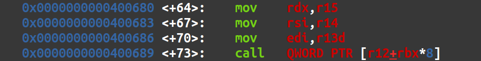

Here is my write-up for the RopEmporium challenge ret2csu! Another great challenge by the creator of RopEmporium. 

# Recon
Let's run `checksec` and have a look at the protections on the binary. 


This is looking good! We can write to the GOT if needed, we won't have to leak a canary, and PIE is not enabled. We are not, however, allowed to execute shellcode off the stack. 

The challenge description states that like previous RopEmporium challenges, all we have to do is find a way to call the `ret2win()` function with three arguments; `0xdeadbeefdeadbeef`, `0xcafebabecafebabe`, and `0xd00df00dd00df00d`. Since this is x86_64, we'll need to populate the `RDI`, `RSI`, and `RDX` registers with those three respective arguments. To do this, we'll need a pop gadget of sorts. That will allow us to pop those arguments we send in off the stack and into those registers. 

But we're getting ahead of ourselves. How are we going to redirect execution of this program to where we want it? In `gdb` we can see that the `main()` function is calling the same `pwnme()` function we have seen before. This means that it is probably vulnerable to a buffer overflow. 


We can verify this in `gdb` by attempting to crash the program with a long De Bruijn sequence. 


Looks like we got a segfault and managed to crash the program! Using `cyclic -l` to lookup the pattern it seems that our offset to the `rip` is 40 bytes. Next, we'll have to find some ROP gadgets to pop our arguments into so we can successfully call `ret2win()` and get our flag! 

However, that is easier said then done. A preliminary look at available ROP gadgets using `ROPGadget` yields nothing to pop into the `rdx` register which prevents us from properly calling `ret2win()`. But wait! The author of this challenge directed us to a [Blackhat Asia](https://i.blackhat.com/briefings/asia/2018/asia-18-Marco-return-to-csu-a-new-method-to-bypass-the-64-bit-Linux-ASLR-wp.pdf) paper which outlines a new ROP technique. 

Basically, even dynamically compiled executables have statically linked components. One such component is the `__libc_csu_init()` function which implements initializers and finalizers in the program. According to a
[paper](https://katie.cs.mtech.edu/classes/csci305/Schedule/InitFinal_Paper.pdf) I found, initializers assign space in memory and values to objects while finalizes do the opposite; they remove values from memory. That's really not relevant here. What is relevant are the instructions that `__libc_csu_init()` contains. It contains two ROP gadgets that when combined allow us to populate the three registers we need. 

By disassembling `__libc_csu_init()` in `gdb`, we can find these gadgets and they are as follows. 

Gadget 1:


Gadget 2:


So, what will these allow us to do? Well, we can see that the second gadget moves items from registers `r15`, `r14`, and `r13d` into the `rdx`, `rsi`, and `edi` registers respectively. This is exactly what we want! Furthermore, gadget one will allow us to populate `r15`, `r14`, and `r13d` in the first place! 

# Exploitation
So, the payload is looking like this... 
1. 40 bytes to overflow the buffer up the `rip`,
2. The address of gadget 1 followed by our three arguments and then some junk to satisfy `r12`, `rbp`, and `rbx` (since they won't end up being moved anywhere we need)
3. Our second gadget to move our arguments into the proper registers
4. And then the address of `ret2win()`!!

This all checks out right? Well, as we'll find out, not entirely. But lets set up the start of a python script and we can get debugging. 

The start of the script is pretty basic. We'll define our executable as an `ELF` object, make it so we can interact with it as a process, and define our offset. 

```python
from pwn import *
elf = context.binary = ELF('ret2csu')
p = elf.process()
offset = 40
```

Next we can dig into `gdb` and define the addresses of those gadgets as well as the address of `ret2win()`. 

```python
pop_gadgets = 0x40069a
mov_gadgets = 0x400680
ret2win = 0x400510
```

And then we can craft our payload and try to send it! 

```python
payload = flat([
	offset * 'a',
	pop_gadgets,
	0x0,
	0x1,
	0x2,
	0xdeadbeefdeadbeef,
	0xcafebabecafebabe,
	0xd00df00dd00df00d,
	mov_gadgets,
	ret2win
])

p.sendline(payload)
p.interactive()
```

Aaaaanndd we segfaulted. So, let's dive into some debugging. I'm going to set a break point at the address of first gadget we're using so I can debug the whole ROP chain. 

After attaching `gdb` to the process and setting a break point, I found there was one instruction at the end of the second gadget that was causing a segfault. 


After some googling, I figured out why this is. This instruction requires a pointer to a valid function. In the current payload `rbx` is being filled with 0x0 and `r12` is being filled with 0x2. This would result in a pointer that is not valid and would cause a segfault. How can we get around this? Well, we can find a pointer to a function within the binary that when called won't really do anything. 

One section where we can look for pointers to potentially useful things is in the `.dynamic` section of this ELF executable. This section is present because this program is dynamically linked. The function I used is the `__fini` function and a pointer to it exists in the `.dynamic` section which works out. I can grab the pointer to this function from ghidra. So, the instruction should theoretically end up like this: `call qword ptr [__fini + rbx*8]`. And for this to be accurate we'll want `rbx*8` to be a non factor so we'll just put `0` into the `rbx` so that `rbx*8` evaluates to `0`. The modified payload will look like this:
```python

fini_pointer = 0x00600e48
payload = flat([
	offset * 'a',
	pop_gadgets,
	0x0,
	0x1,
	fini_pointer,
	0xdeadbeefdeadbeef,
	0xcafebabecafebabe,
	0xd00df00dd00df00d,
	mov_gadgets,
	ret2win
])

p.sendline(payload)
p.interactive()
```

Let's give it a whirl! Arggghhh, another segfault. Let's hop back into the debugger. After some more debugging, we can see that we have indeed passed that `call` instruction we were stuck on before! But now we've got another problem. After the `__fini()` function is called, we return back into the `__libc_csu_init()` function. This is because our exploit execution flow looks like this; gadget 1, ret, gadget 2, call to `__fini()`, ret. That last ret puts us back into the place we left off in after gadget 2 in `__libc_csu_init()`. If you remember, gadget 2 comes before gadget one in that the `__libc_csu_init()` function and there is no ret after it. So, we are now executing through the `__libc_csu_init()` function which means that we will hit gadget 1 again. Gadget 1 contains so many pops that it pops the return address of `__libc_csu_init()` off the stack which it was never intended to do! So, the item that end up getting popped off the stack to return to is the value 0x0 which would of course result in a segfault. So what can we do? Well, we can add some extra padding to fill up all those pop instructions so we can ensure that the address of `ret2csu()`, the place where `__libc_csu_init()` should return when it is done (because we put it on the stack via the buffer overflow), is popped off and correctly returned to. 7 bytes of padding should do the trick. 

Ok, now let's run the script again with our modified payload and see what happens! 

```python
payload = flat([
        offset * 'a',
        pop_gadgets,
        0x0,
        0x1,
        fini_pointer,
        0xdeadbeefdeadbeef,
        0xcafebabecafebabe,
        0xd00df00dd00df00d,
        mov_gadgets,
        0x0, 
        0x0,
        0x0,
        0x0,
        0x0,
        0x0,
        0x0,
        ret2win
])
```

Rats!! We got another segfault!! Back into `gdb` we go. 

Jumping back into `gdb` we can see that we are indeed getting the `ret2win()` function to execute! However, the program exits due to "incorrect parameters". Upon closer inspection, the `rdi` register, which is supposed to contain the first argument of `0xdeadbeefdeadbeef`, only contains `0xdeadbeef`. Looking back through our gadgets it becomes clear why. 

The gadget responsible for moving the `r13` register into the `rdi` register is moving `r13b` into `edi`, like so; `mov edi, r13b`. Even though the full argument is popped into `r13`, only the lower 32 bits (`r13b` represents the lower 32 bytes of the `r13` register) are moved into `rdi`. Or, in this case, the lower `32` bits of the full `rdi` register which here is represented as `edi`. 

So, one thing we can do, is to try and find a `pop rdi; ret;` gadget within the binary to try and pop the full 64 bit argument into the `rdi` register. And what do ya know, there is one! We lucked out :)


Now, with our updated payload, we should get the flag! 

```python
pop_rdi = 0x00000000004006a3
payload = flat([
        offset * 'a',
        pop_gadgets,
        0x0,
        0x1,
        fini_pointer,
        0xdeadbeefdeadbeef,
        0xcafebabecafebabe,
        0xd00df00dd00df00d,
        mov_gadgets,
        0x0, 
        0x0,
        0x0,
        0x0,
        0x0,
        0x0,
        0x0,
        pop_rdi,
        0xdeadbeefdeadbeef,
        ret2win
])
```

And what do ya know, it works! This was a fun challenge that taught me about a cool ROP technique. Below is the full exploit. 

```python
from pwn import *

elf = context.binary = ELF('ret2csu')
p = elf.process()

offset = 40

pop_gadgets = 0x40069a
mov_gadgets = 0x400680
ret2win = 0x400510
fini_pointer = 0x00600e48
pop_rdi = 0x00000000004006a3

payload = flat([
        offset * 'a',
        pop_gadgets,
        0x0,
        0x1,
        fini_pointer,
        0xdeadbeefdeadbeef,
        0xcafebabecafebabe,
        0xd00df00dd00df00d,
        mov_gadgets,
        0x0, 
        0x0,
        0x0,
        0x0,
        0x0,
        0x0,
        0x0,
        pop_rdi,
        0xdeadbeefdeadbeef,
        ret2win

p.sendline(payload)
p.interactive()
```