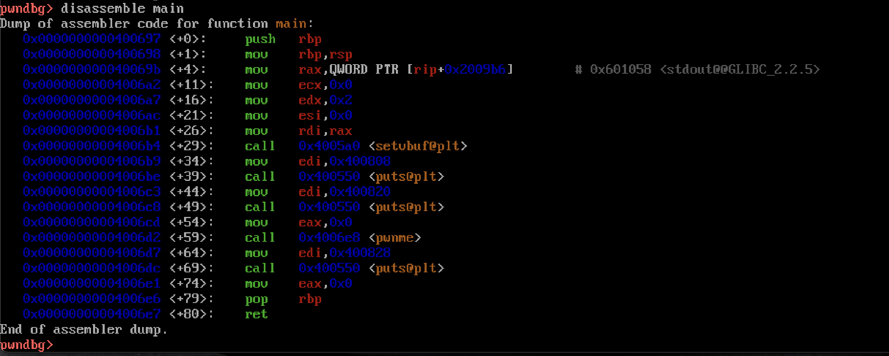

# Intro
After discovering how much I enjoyed the pwn CTF category, I started looking into ways to improve my skills. The first thing that was immediately clear was just how expansive the category of binary exploitation is. From buffer overflows to heap exploitation, and everything in between, it was quite overwhelming at first. Not to mention I had very little familiarity with how computer architecture worked in the first place. As I worked to get my bearings, I discovered [https://ropemporium.com](https://ropemporium.com). This website contains eight challenges designed to teach the basics of a fundamental binary exploitation technique, Return Oriented Programming or ROP. My goal is to create a writeup of each ROP Emporium challenge every week for eight weeks. Before I get into the first challenge, I would like to give a shoutout to [CryptoCat](https://www.youtube.com/channel/UCEeuul0q7C8Zs5C8rc4REFQ) on YouTube. His videos  on these challenges helped me extensively, whether it was debugging a solution or further understanding why something worked the way it did, his help was invaluable. Without further ado, lets have a look at the first challenge, called `ret2win`. 

# Recon
When we click on the challenge on the website, we are presented with a little introduction and some download links for various versions of the challenge. We will  solving the `x86-64` bit version in this writeup. Once the file is downloaded, we can unzip it and do some recon on the binary which is called `ret2win`. We will use a tool called `checksec`, which will analyze the binary for us to view some of its protections.
```bash
$ checksec --file=ret2win
```

Now we know what protections are enabled on the binary. We have `Partial RELRO`, `No Stack Canary`, `NX Enabled`, and `No PIE`. No canary and no PIE will make overflowing the buffer pretty easy since there is nothing stopping us from smashing the stack and addresses will remain constant. Because NX is enabled we will not be able to execute off the stack which means no shellcode off the stack. RELRO will not come into play in this challenge. According to the challenge description, in order to get the flag read to us, we will want to find a way to either get a shell to read it ourselves, or find a way for the program to display it out to us. The description also hints at a suspiciously named function called `ret2win()`. This is a hint that perhaps by calling this function we can have the flag printed out to us. 

In order to verify if that is the case, lets have a look at this program in GDB. I will be using a GDB plugin called `pwndbg` which adds some extra features. It can be checked out [here](https://github.com/pwndbg/pwndbg). Once we load the binary into GDB, we can have a look at the functions with `info functions`. 


Notable functions include a `main()` function, a `pwnme()` function, and a `ret2win()` function. Let's have a look inside these functions using GDB's disassemble functionality to try and get a good gauge of how this program is layed out. Let's start with the `main()` function. To disassemble a function in GDB we can use `disassemble main`. 



Looking at the `main()` function, we can see that it calls several functions, namely `setvbuf()`, `puts()`, and the `pwnme()` function. Nothing seems overtly exploitable here, but the notable thing is that this main function is calling `pwnme()`. This must be where our vulnerability is, as the name of the function would suggest. Let's have a look at that function next. 


Several things are happening here, most notably there is a call to `read()`. Now we can step back a bit and make a few infrences. When we run the program, it tells us the following:


This must mean that the `read()` function is allowing us to read in 56 bytes while only allocating 32 bytes of stack space which would allow us to smash the stack and gain control of the program execution. So, now that we know we have control over the execution of the program, what next? Well we know we have to have the flag printed out to us somehow so let's hop back into GDB and have a look at that `ret2win()` function. 


We can see that the `ret2win()` function is calling system with an argument located at `0x400943`. Remember as per x86-64 calling conventions the first argument for functions called is stored in the `rdi` register and we can see an argument being moved into the `edi` register just before system is called, which is the lower order version of the `rdi`. What could that argument be? Judging from the name of the challenge and the description, it could be something like `cat flag.txt` or `/bin/sh`. Either of these would allow us to read the flag. 

So, now we know that we have control over the programs execution via a buffer overflow and we need to call `ret2win()` to (hopefully) print out the flag. 

# Exploitation
The goal of our exploit will be to overflow the buffer just enough to gain control of the `rip`, which is the register that holds the address of the current instruction the program is executing. If we can overwrite `rip` with, lets say the address of the `ret2win()` function, we can control program execution to call `ret2win()` which was never meant to be called. We will use the principle called ROP (duh) which means we will leverage the control of return addresses to redirect the execution of the program to where we want it. So now we know two things; we will need to overflow the buffer enough to control `rip` and we will need the address of `ret2win()`. Now, lets solve this challenge! 

To find out how many characters we will need to gain control of the `rip`, we can use `pwndbg` to generate a De Bruijn sequence with the command:
```bash
cyclic 50
```

The nature of the De Bruijn sequence means that we can find out how many characters there are up to a certain point in the sequence. This means we will be able to pass this into the program, watch it segfault, and then pinpoint exactly how many characters of input it takes to reach the `rip`. Let's have a look at this in GDB. 

After entering in our cyclic pattern, we can see that the program crashed! We can see GDB's output below. 


From our cyclic pattern we can see that part of our pattern was left in the `rip`! This is exactly what we wanted. To find out how many characters it took, we can do:
```bash
$ cyclic -l faaaaaaa
```

This returns 40, which means that it took 40 characters to overflow the buffer and leak into `rip`. Ultimately we will need to send in 40 characters to overflow the buffer right up to we get to `rip`, and then pass in the address of `ret2win()` so that we can successfully redirect program execution to that function. We can now start crafting an exploit script. I will be using a popular python library for pwn challenges called `pwntools`. It comes with some amazing functionality to exploit these types of challenges. This challenge will only be scratching the surface. 

First we will import the pwn tools library and define our binary. We will use `context.binary` so that pwntools knows its an x86-64 binary and it take care of things like endianness for us. We will use an `ELF()` object so that pwntools can access all of the symbols and such for our binary. 

```python
from pwn import *

elf = context.binary = ELF("./ret2win")
```

Next we will define a couple more things. We will make our binary a process so that pwntools can run it and send input in, and we will define our offset. 

```python
p = elf.process()

offset = 40
```

Then we can make note of the address of our `ret2win()` function. This address can be obtained from GDB, just like we were doing before. 

```python
ret2win = 0x400756
```

Now we can now construct our payload. We can send in 40 a's to smash the stack just enough and then send in the address of our `ret2win()` function so that `rip` will point to the `ret2win` function. To do this we will use the `flat()` function so that our payload will be converted into bytes. Since we specified the context of the binary, pwntools will automatically send our payload in the proper endianness and pad to the proper address size. 

```python
payload = flat([
	offset * 'a',
	ret2win
])
```

Then we can send this to the program/process using the line:

```python
p.sendline(payload)
```

Finally we can use interactive mode to view any output that the program spit back at us. Like our flag! 

```python
p.interactive()
```

Our final payload will look something like this:

```python
from pwn import *

elf = context.binary = ELF("./ret2win")

p = elf.process()

offset = 40

ret2win = 0x400756

rop_gadget = 0x000000000040053e
payload = flat([
	offset * b'A',
	ret2win_func
	])

p.sendlineafter(payload)

p.interactive()
```

Once we run this script, we should get the flag! 


And we do! 

This was the first of the ROP Emporium challenges. Like I mentioned previously, I plan on writing up one challenge per week. As I go I will phase out things I covered in previous writeups to avoid redundancy. These challenges were very fun to solve and really helped me learn more about binary exploitation. Hope you enjoyed! 


